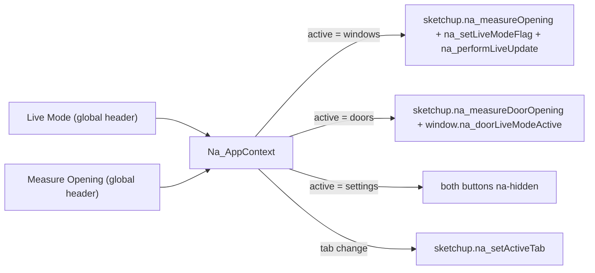
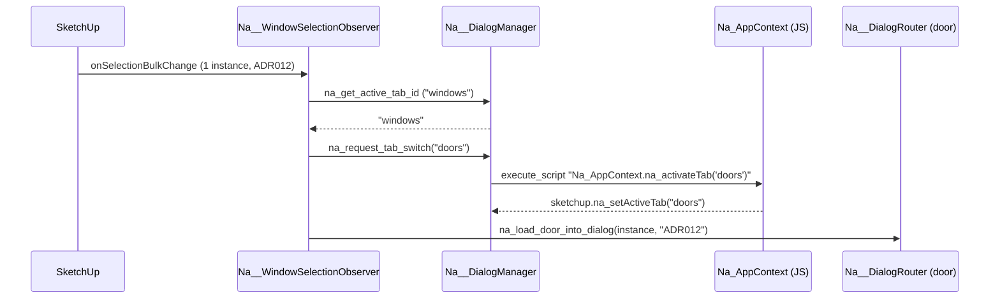

# Na Window Configurator Tool - Architecture Diagram

## Overview

This document provides a comprehensive diagram of how the Window Configurator Tool works, including data flow, file relationships, and the planned feature additions.

## Feature Addendum - Per-Panel Casement Toggle (v0.10.4)

### Concept

`removed_casements` was previously an array of bare opening indices (e.g. `[0, 2]`) and a single click target spanned each opening's full inner height. This blocked toggling individual casements within transom-divided cells or `casements_per_opening > 1` openings.

The system now tracks removal at the **panel** level, matching the pattern already used by transom segments and individual glaze bars.

### New Key Format

`removed_casements` entries are now strings of the form:

```
"<openingIndex>:<cellIndex>:<panelIndex>"
```

- `openingIndex` -- mullion-bounded opening (left-to-right).
- `cellIndex` -- transom-bounded cell within that opening (bottom-to-top).
- `panelIndex` -- casement panel within that cell (`0..casements_per_opening - 1`).

Sliding-sash sashes inside one panel share the same key, so toggling a panel removes both top and bottom sashes together (consistent with how `casements_per_opening` already groups rails/glass into discrete panels).

### Click Target Layering

| Class | Identity | Storage Array |
|-------|----------|---------------|
| `na-opening-click-target` | `openingIndex:cellIndex:panelIndex` | `removed_casements` |
| `na-transom-click-target` | `openingIndex:transomIndex` | `removed_transom_segments` |
| `na-glazebar-click-target` | `openingIndex:cellIndex:panelIndex:sashIndex:orientation:barIndex` | `removed_glazebars` |

The casement click target is now emitted **inside** the per-cell, per-panel SVG loop in `na_generateOpeningCellSvg` (one rect per panel), so any framework-bound region -- between mullions, between transoms, or within a multi-panel opening -- can be toggled independently. The red dashed "removed casement" indicator likewise renders per panel.

### Data Flow Touchpoints

- **`Viewport__SvgGenerator__.js`** -- new helpers `na_getCasementKey`, `na_getRemovedCasementSet`, `na_isPanelCasementRemoved`. Per-panel click rects and per-panel removed-indicator rects are generated inside the cell/panel loop. `na_collectValidGlazebarKeys` now uses the per-panel removal check so removing one panel's casement no longer invalidates other panels' glaze bar keys.
- **`Viewport__Controls__.js`** -- `na-opening-click-target` reads `data-cell-index` and `data-panel-index` and forwards `(openingIndex, cellIndex, panelIndex)` to the click callback.
- **`UiLogic__.js`** -- `na_toggleCasementRemoval(openingIndex, cellIndex, panelIndex)` toggles the new keyed entry. `na_onConfigChange` migrates legacy bare-integer entries (see below) and prunes stale keys against `na_getValidCasementKeySet()`.
- **`GeometryEngine__.rb`** -- new `na_panel_casement_removed?` helper (legacy-aware). `na_create_multi_casement_opening` and `na_create_sliding_sash_opening` compute `panel_has_casement` per panel.
- **`DxfExporterLogic__.rb`** -- mirrors the per-panel check inside the cells loop.
- **`Export__Dxf__.js`** -- mirrors the per-panel check using helpers exposed by `Na__Viewport__SvgGenerator`.

### Legacy Migration (Backward Compatibility)

Saved configurations using the old bare-integer format (e.g. `removed_casements: [0, 2]`) still render correctly:

- **JS render path:** `na_getRemovedCasementSet` separates legacy bare integers into a `legacyOpenings` Set. `na_isPanelCasementRemoved` returns `true` if the panel's opening is in that Set, so every cell/panel of that opening reads as removed.
- **Ruby render path:** `na_panel_casement_removed?` accepts both string keys and legacy integers (or stringified integers) and produces the same per-panel decision.
- **Migration on load:** the next `na_onConfigChange` cycle expands every legacy bare integer to per-panel `"i:c:p"` keys for every current cell/panel of that opening, then writes the migrated array back to `_config.removed_casements`. From that point on the array saves and loads cleanly in the new format.

`removed_transom_segments` and `removed_glazebars` are unaffected by this change.

---

## Feature Addendum - Door Mode Casement Integration (v0.10.1)

### Concept

Door Mode converts the window into a door. Each casement becomes a full-height door with the panel integrated inside:
- **Upper glazed zone** -- glass + glaze bars sit above a mid-rail
- **Lower solid panel zone** -- configurable grid of recessed panels with optional trim/moulding sits below the mid-rail
- The casement stiles span the full height; top rail, mid-rail, and bottom rail divide the zones
- No separate transom-like divider -- the panel is part of the casement group
- Multi-casement openings produce independent doors, each with their own panel

### New Config Fields

| Field | Type | Default | Description |
|-------|------|---------|-------------|
| `door_mode` | boolean | `false` | Master toggle for door mode |
| `door_panel_height_mm` | number | `400` | Height of the solid lower panel section |
| `door_panel_columns` | integer | `2` | Number of panel columns (1--4) |
| `door_panel_rows` | integer | `1` | Number of panel rows (1--3) |
| `door_panel_rail_width_mm` | number | `30` | Width of horizontal dividers between rows |
| `door_panel_stile_width_mm` | number | `30` | Width of vertical dividers between columns |
| `door_panel_margin_mm` | number | `30` | Margin from casement/frame edge to panel grid |
| `door_panel_recess_depth_mm` | number | `8` | How deep each panel is recessed |
| `door_panel_trim_width_mm` | number | `5` | Trim/moulding border width |
| `door_panel_trim_depth_mm` | number | `3` | Trim protrusion depth |
| `door_panel_moulding_inset_mm` | number | `5` | Pushes moulding back from casement front face |

### Data Flow

`door_mode toggle (Options)` -> `Na_DynamicUI._config` -> `na_updateDoorPanelVisibility()` shows/hides Door Panel section -> `UiEventToRubyApiBridge` passes config -> `GeometryEngine.na_parse_config` extracts door params -> `na_render_opening_panel_geometry` routes to `na_render_door_casement_geometry` -> builds full-height casement (stiles + top/bottom/mid rails) + glass in upper zone + `DoorPanelBuilder.na_create_door_panel_section` fills lower zone with grid dividers, recessed panels, and trim.

### New Files

1. **`Na__WindowConfiguratorTool__DoorPanel__Config__.js`** -- `NA_DOOR_PANEL_CONFIG` array with all door panel UI control descriptors
2. **`Na__WindowConfiguratorTool__DoorPanel__GeometryBuilder__.rb`** -- `Na__DoorPanelGeometryBuilder` module with panel section geometry creation

### Modified Files

1. **`Na__WindowConfiguratorTool__Ui__Config__.js`** -- `door_mode` toggle in `NA_OPTIONS_CONFIG`
2. **`Na__WindowConfiguratorTool__UiLayout__.html`** -- Door Panel section container + script include
3. **`Na__WindowConfiguratorTool__UiLogic__.js`** -- builds door panel controls, defaults, visibility management
4. **`Na__WindowConfiguratorTool__GeometryEngine__.rb`** -- parses door config, splits height, calls door panel builder, creates divider
5. **`Na__WindowConfiguratorTool__Main__.rb`** -- requires new module, adds door panel defaults
6. **`Na__WindowConfiguratorTool__Viewport__SvgGenerator__.js`** -- renders door panel area and divider in 2D preview

### Geometry Detail

For each casement panel in door mode, `na_render_door_casement_geometry` builds:
1. **Full-height casement stiles** -- left and right stiles spanning the entire panel height
2. **Top rail** -- at the top of the casement
3. **Bottom rail** -- at the bottom of the casement
4. **Mid-rail** -- horizontal member at the glass/panel junction (casement bottom rail thickness)
5. **Glass + glaze bars** -- placed in the upper zone (between mid-rail and top rail)
6. **Door panel content** -- `DoorPanelBuilder.na_create_door_panel_section` fills the lower zone with grid dividers, recessed panels, and trim/moulding

### FuseParts Integration

- **Casement fusion** (`Na_Casement_{panel_id}_*`): stiles, top rail, bottom rail, and mid-rail all fuse into one solid per panel
- **Door panel fusion** (`Na_DoorPanel_{panel_id}_*`): grid stiles, rails, and recessed panels fuse per panel
- **Door trim fusion** (`Na_DoorTrim_{panel_id}_*`): all trim strips fuse per panel
- Two new steps in `na_fuse_window_parts`: `na_fuse_door_panels` and `na_fuse_door_trim`

### Integration

- **Mullions + door mode**: each opening gets independent doors; mullions span full height
- **Transoms + door mode**: transoms apply to the full opening height
- **Cill**: automatically disabled when door mode is on
- **Multi-casement**: each casement panel independently contains its own lower panel section

---

## Feature Addendum - Header Reload Icon (v0.9.12d)

### UI

- The main dialog header reload action is an icon-only button (`na-btn-icon`, Unicode `U+21BB`) with `title="Reload Scripts"`, matching the compact control used in Na Array Builder.
- Click handling remains `na_reloadScripts()` in the HTML layout, which delegates to `sketchup.na_reloadScripts()` via `Na__WindowConfiguratorTool__UiEventToRubyApiBridge__.js`.
- If `Na__WindowConfiguratorTool__UiLayout__.html` is missing, fallback HTML in `Na__WindowConfiguratorTool__DialogManager__.rb` exposes the same glyph with class `na-fallback-reload`.

### Files

- `Na__WindowConfiguratorTool__UiLayout__.html` — reload control markup
- `Na__WindowConfiguratorTool__Styles__.css` — `.na-btn-icon`
- `Na__WindowConfiguratorTool__DialogManager__.rb` — fallback reload control

## Feature Addendum - FuseParts Per-Panel Fusion Fix (v0.9.12c)

### Bug Fix

- `FuseParts__.rb` previously grouped casement and glaze bar parts by the first numeric segment of the group name (the opening index). This caused all casement panels within the same opening to be merged into a single solid when `fuse_parts` was enabled with `casements_per_opening > 1`.

### Changes

- Replaced `na_find_unique_indices` with `na_find_unique_panel_ids` which uses suffix-aware regex parsing to extract full panel identifiers (e.g. `0_0_P0`, `0_0_P1`) from group names.
- Casement fusion now produces one solid per panel: `Na_Casement_{panel_id}_Fused` instead of one solid per opening.
- Glaze bar fusion now produces one solid per panel: `Na_GlazeBar_{panel_id}_Fused`.
- Glass trimming now correctly matches each panel's glass pane (`Na_Glass_{panel_id}`) to its corresponding fused glaze bar solid.
- Replaced `na_extract_index_from_fused_name` with `na_extract_panel_id_from_fused_name` which extracts the full panel_id from between the prefix and `_Fused` suffix.
- Frame fusion (`na_fuse_frame`) is unchanged -- frame, mullion, and transom groups are still correctly fused into one structural solid.

### Affected Files

1. **`Na__WindowConfiguratorTool__FuseParts__.rb`** -- all changes in this file only

---

## Feature Addendum - Reset Hidden Elements Action (v0.9.12b)

### UI / State Notes

- The 2D preview toolbar now includes a `Reset Elements` button next to the viewport actions.
- The button clears all current hidden-element state in one action by resetting:
  - `removed_casements`
  - `removed_transom_segments`
  - `removed_glazebars`
- The button is disabled when there are no hidden elements to restore.
- Resetting flows through the normal `UiLogic _config -> render -> live update` path, so the preview, live SketchUp model, saved config, and DXF exports all return to the fully visible state together.

## Feature Addendum - Individual Glaze Bar Toggles (v0.9.12a)

### New Shared Config Fields

The glaze bar system now supports per-visible-bar removal keys in addition to the existing global horizontal and vertical bar counts:

- `removed_glazebars` - array of `"openingIndex:cellIndex:panelIndex:sashIndex:orientation:barIndex"` keys for individual bars that should be suppressed

This value now flows through the same shared configuration path as the existing removal systems:

`UiLogic _config` -> `Viewport__SvgGenerator__` / `Viewport__Controls__` -> `UiEventToRubyApiBridge__` -> `DialogManager__.rb` -> `GeometryEngine__.rb` / `GeometryBuilders__.rb` -> `DxfExporterLogic__.rb` / `Export__Dxf__.js`

### Layout / Identity Behaviour

- `openingIndex` identifies the mullion span.
- `cellIndex` identifies the transom-aware stacked cell inside that span.
- `panelIndex` identifies the horizontal panel when `casements_per_opening > 1`.
- `sashIndex` distinguishes top vs bottom sash in sliding sash mode.
- `orientation` is either `horizontal` or `vertical`.
- `barIndex` stays `1`-based to match the existing bar-spacing loops in both JavaScript and Ruby.

### UI / Preview Notes

- Individual glaze bars are now toggleable directly from the SVG preview.
- Each bar position has a dedicated transparent click rectangle rendered above the opening/transom overlays so bar clicks win reliably inside the SketchUp HtmlDialog renderer.
- Click rectangles remain active even when the visible bar has been removed, allowing the same location to be clicked again to restore the bar.
- `UiLogic__.js` now cleans stale `removed_glazebars` keys whenever the current opening/cell/panel/sash layout changes.

### Geometry / Export Notes

- `GeometryEngine__.rb` now carries opening, cell, panel, and sash identity through to the glaze bar builder.
- `GeometryBuilders__.rb` now skips only the specific keyed bars that were removed instead of suppressing whole bar rows/columns globally.
- `DxfExporterLogic__.rb` and `Export__Dxf__.js` now skip the same keyed bars so exported drawings stay aligned with the preview and live 3D model.

## Feature Addendum - Advanced Frame Controls (v0.9.12)

### New Shared Config Fields

The frame system now supports an optional per-side override layer on top of the existing uniform frame thickness:

- `advanced_frame_controls` - enables per-side frame thickness overrides when `true`
- `frame_top_thickness_mm`
- `frame_bottom_thickness_mm`
- `frame_left_thickness_mm`
- `frame_right_thickness_mm`

These values now flow through the same full-config path used by the other advanced override systems:

`Ui__Config__` -> `UiLogic _config` -> `Viewport__Validation__` / `Viewport__SvgGenerator__` -> `UiEventToRubyApiBridge__` -> `DialogManager__.rb` -> `GeometryEngine__.rb` / `DxfExporterLogic__.rb`

### Behaviour Notes

- `frame_thickness_mm` remains the base slider and backward-compatible fallback for saved windows.
- When `advanced_frame_controls` is `false`, all four effective frame sides use `frame_thickness_mm`.
- When `advanced_frame_controls` is `true`, the top/bottom/left/right override sliders drive the effective inner opening rectangle.
- Asymmetric frames now shift the opening origin and inner clear size:
  - `inner_width = width - left_frame - right_frame`
  - `inner_height = height - top_frame - bottom_frame`
- Cills and opening-measurement deductions now depend on the effective bottom frame thickness instead of assuming one uniform frame member all round.

### Geometry / Export Notes

- `GeometryBuilders__.rb` now builds the outer frame from separate left/right stile widths and top/bottom rail heights.
- `GeometryEngine__.rb`, `Viewport__SvgGenerator__.js`, `Viewport__Validation__.js`, and both DXF exporters all use the same effective per-side frame logic.
- A `0mm` side value now creates a frameless edge on that side only; the other sides can still render normally.

## Feature Addendum - Transom System (v0.9.11)

### New Shared Config Fields

The transom system extends the shared `windowConfiguration` contract with:

- `transoms` - number of active transom levels (`0-3`)
- `transom_width_mm` - transom member height/thickness in the 2D/3D layouts
- `transom_1_y_mm`
- `transom_2_y_mm`
- `transom_3_y_mm`
- `removed_transom_segments` - array of `"openingIndex:transomIndex"` keys for spans where a transom segment is intentionally suppressed

These values now flow through the same full-config path used by mullions:

`Ui__Config__` -> `UiLogic _config` -> `Viewport__Validation__` / `Viewport__SvgGenerator__` -> `UiEventToRubyApiBridge__` -> `DialogManager__.rb` -> `GeometryEngine__.rb` / `DxfExporterLogic__.rb`

### Layout Behaviour

- Mullions still split the window horizontally into opening spans.
- Transoms now split each opening span vertically into stacked cells.
- Transom levels are shared globally by slider value, but each span can suppress an individual transom segment via `removed_transom_segments`.
- When a transom segment is removed in one span, the adjacent cells merge in that span only.
- Casements, direct glazing, glaze bars, sliding sash rendering, 3D geometry, and DXF output are all generated from these merged cells rather than from one full-height opening rectangle.
- As of v0.10.4, individual casements inside transom-bound cells (and inside multi-panel openings) are toggleable directly from the SVG preview -- see "Feature Addendum - Per-Panel Casement Toggle".

### UI / Preview Notes

- The new transom controls live in `Na__WindowConfiguratorTool__Ui__Config__.js` after the mullion controls.
- `UiLogic__.js` now handles:
  - visibility of transom width / height sliders
  - ordering and clamping of active transom heights
  - one-transom default seeding at roughly one-third of the inner frame height when first enabled
  - flipped UI coordinate conversion so transom sliders are shown in top-origin terms while the internal config stays bottom-origin
  - cleanup of stale `removed_transom_segments`
- `Viewport__Controls__.js` now routes both opening click targets and transom-segment click targets.
- Transom click targets use a minimally painted overlay in the SVG so segment toggling remains reliable inside the SketchUp HtmlDialog renderer.

### Geometry / Export Notes

- `GeometryHelpers__.rb` and `GeometryBuilders__.rb` now include a dedicated transom primitive/builder.
- `GeometryEngine__.rb` now builds per-opening transom segments first, then renders merged opening cells.
- `FuseParts__.rb` now includes `Na_Transom_*` groups in the frame fusion pass so transoms are fused with the rest of the frame assembly.
- `DxfExporterLogic__.rb` and `Export__Dxf__.js` now mirror the same transom-aware cell layout.
- DXF now includes a dedicated `NA_TRANSOM` layer for horizontal transom members.

### Related Slider Limit Update

- `horizontal_glaze_bars` max increased from `6` to `8`
- `vertical_glaze_bars` max increased from `6` to `8`

---

## File Structure Diagram (Version 0.6.0 - Modular Architecture)

```
┌───────────────────────────────────────────────────────────────────────────────────────┐
│                         ProtoType__3dWindowConfigTool/                                 │
├───────────────────────────────────────────────────────────────────────────────────────┤
│                                                                                         │
│  ┌───────────────────────────────────────┐   ┌───────────────────────────────────────┐│
│  │      RUBY BACKEND (SketchUp)          │   │       JAVASCRIPT FRONTEND              ││
│  ├───────────────────────────────────────┤   ├───────────────────────────────────────┤│
│  │  MAIN ORCHESTRATOR                    │   │  UI LAYER (Ui__)                       ││
│  │  Na__...__Main__.rb (220 lines)       │   │  Na__...__Ui__Config__.js              ││
│  │  ├─ Entry point (na_init)             │   │  └─ Configuration constants            ││
│  │  ├─ Module requires                   │   │  Na__...__Ui__Controls__.js            ││
│  │  └─ Constants                         │   │  └─ HTML generation                    ││
│  │                                       │   │  Na__...__Ui__Events__.js              ││
│  │  DIALOG MANAGEMENT                    │   │  └─ Event handler attachment           ││
│  │  Na__...__DialogManager__.rb (609)    │   │                                        ││
│  │  ├─ HtmlDialog lifecycle              │   │  VIEWPORT LAYER (Viewport__)           ││
│  │  ├─ Ruby ↔ JS callbacks              │   │  Na__...__Viewport__Validation__.js    ││
│  │  ├─ Live mode handling                │   │  └─ Config validation & errors         ││
│  │  └─ DXF export coordination           │   │  Na__...__Viewport__SvgGenerator__.js  ││
│  │                                       │   │  └─ SVG markup generation              ││
│  │  GEOMETRY SYSTEM                      │   │  Na__...__Viewport__Controls__.js      ││
│  │  Na__...__GeometryEngine__.rb (469)   │   │  └─ Pan/zoom/click interaction         ││
│  │  ├─ Create/update orchestration      │   │                                        ││
│  │  ├─ Opening calculations             │   │  EXPORT LAYER (Export__)               ││
│  │  ├─ Config parsing                    │   │  Na__...__Export__Dxf__.js             ││
│  │  └─ Removed casements handling        │   │  └─ DXF generation (browser fallback)  ││
│  │                                       │   │                                        ││
│  │  Na__...__GeometryBuilders__.rb (309) │   │  MAIN ORCHESTRATOR                     ││
│  │  ├─ na_create_frame()                 │   │  Na__...__UiLogic__.js (526 lines)     ││
│  │  ├─ na_create_mullion()               │   │  ├─ Na_DynamicUI module                ││
│  │  ├─ na_create_casement()              │   │  │   ├─ State management               ││
│  │  ├─ na_create_glass()                 │   │  │   ├─ Config updates                 ││
│  │  └─ na_create_cill()                  │   │  │   └─ Button state sync              ││
│  │                                       │   │  └─ Na_Viewport module                 ││
│  │  Na__...__GeometryHelpers__.rb (231)  │   │      ├─ Viewport init                  ││
│  │  ├─ na_create_grouped_box()           │   │      ├─ Render coordination            ││
│  │  ├─ na_create_frame_stile()           │   │      └─ View reset                     ││
│  │  ├─ na_create_frame_rail()            │   │                                        ││
│  │  ├─ na_create_casement_stile()        │   │  BRIDGE                                ││
│  │  ├─ na_create_casement_rail()         │   │  Na__...__UiEventToRubyApiBridge__.js  ││
│  │  ├─ na_create_glaze_bar_*()           │   │  ├─ na_createWindow()                  ││
│  │  └─ Coordinate utilities              │   │  ├─ na_updateWindow()                  ││
│  │                                       │   │  ├─ na_liveUpdate()                    ││
│  │  TOOLS & OBSERVERS                    │   │  ├─ na_showStatus()                    ││
│  │  Na__...__PlacementTool__.rb (272)    │   │  └─ Live mode debouncing (100ms)       ││
│  │  ├─ Crosshair cursor                  │   │                                        ││
│  │  ├─ Grid snapping                     │   └───────────────────────────────────────┘│
│  │  ├─ Rotation (TAB, 4-step 0/90/180/270°) │                                             │
│  │  └─ Preview feedback                  │   ┌───────────────────────────────────────┐│
│  │                                       │   │       HTML / CSS                        ││
│  │  Na__...__MeasureOpeningTool__.rb     │   ├───────────────────────────────────────┤│
│  │  ├─ Two-click measurement             │   │                                        ││
│  │  ├─ Blue overlay rectangle (GL_QUADS) │   │                                        ││
│  │  ├─ Plane detection (XZ/YZ)           │   │                                        ││
│  │  └─ Sends dims to dialog              │   │                                        ││
│  │                                       │   │                                        ││
│  │  Na__...__Observers__.rb (82)         │   │                                        ││
│  │  └─ SelectionObserver for Live Mode   │   │  Na__...__UiLayout__.html (237)        ││
│  │                                       │   │  ├─ Header (Reload/Live/Measure btns)  ││
│  │  DATA & UTILITIES                     │   │  ├─ Status bar                         ││
│  │  Na__...__MaterialManager__.rb (380)  │   │  ├─ 2D Viewport section                ││
│  │  ├─ Material library loading          │   │  ├─ Dimensions section                 ││
│  │  ├─ Standard material creation        │   │  ├─ Glaze Bars section                 ││
│  │  └─ Material lookup & caching         │   │  ├─ Cill & Frame section               ││
│  │                                       │   │  ├─ Options + Material Cards            ││
│  │  Na__...__DataSerializer__.rb (447)   │   │  ├─ Actions (Create + Update btns)     ││
│  │  ├─ Save/load window data             │   │  ├─ Window Info (ID, Desc, Dates)      ││
│  │  ├─ Generate window IDs (AWNxxx)      │   │  └─ Script includes (9 files)          ││
│  │  └─ Attribute management              │   │                                        ││
│  │                                       │   │  Na__...__Styles__.css                 ││
│  │  Na__...__DebugTools__.rb (317)       │   │  ├─ CSS Variables                      ││
│  │  └─ Debug logging & tracing           │   │  ├─ Control styles                     ││
│  │                                       │   │  ├─ Layout styles                      ││
│  │  CONFIGURATION                        │   │  └─ Viewport styles                    ││
│  │  Na__AppConfig__MaterialsLibrary.json │   │                                        ││
│  │  └─ Material definitions & properties │   │                                        ││
│  │                                       │   │  └─ Script includes (9 files)          ││
│  │                                       │   │                                        ││
│  │  Na__...__DxfExporterLogic__.rb (489) │   │  Na__...__Styles__.css                 ││
│  │  ├─ Full DXF generation               │   │  ├─ CSS Variables                      ││
│  │  ├─ Layer management                  │   │  ├─ Control styles                     ││
│  │  └─ 2D CAD geometry export            │   │  ├─ Layout styles                      ││
│  │                                       │   │  └─ Viewport styles                    ││
│  │  POST-PROCESSING                      │   │                                        ││
│  │  Na__...__FuseParts__.rb              │   │                                        ││
│  │  ├─ Sequential outer_shell fusion     │   │                                        ││
│  │  ├─ Frame/casement/glaze bar fusing   │   │                                        ││
│  │  ├─ Glass panel trimming              │   │                                        ││
│  │  └─ Only on Create/Update (not Live)  │   │                                        ││
│  │                                       │   │                                        ││
│  └───────────────────────────────────────┘   └───────────────────────────────────────┘│
└───────────────────────────────────────────────────────────────────────────────────────┘

MODULE DEPENDENCIES:
Ruby: Main → requires all → MaterialManager, DialogManager, GeometryEngine, PlacementTool, MeasureOpeningTool, Observers, FuseParts
      Main → MaterialManager (initializes on startup)
      GeometryEngine → MaterialManager (material lookups)
      GeometryEngine → GeometryBuilders → GeometryHelpers
      DialogManager → FuseParts (post-processing, Create/Update only)
JavaScript: Config → Controls, Events → UiLogic → Viewport modules → Export → Bridge
```

---

## Data Flow Diagram (Version 0.6.0 - Modular Architecture)

```
┌─────────────────────────────────────────────────────────────────────────────┐
│                           USER INTERACTION                                  │
└───────────────────────────────────┬─────────────────────────────────────────┘
                                    │
                                    ▼
┌─────────────────────────────────────────────────────────────────────────────┐
│                        HTML DIALOG (UI)                                     │
│  ┌──────────────────────────────────────────────────────────────────────┐   │
│  │  SLIDERS / TOGGLES / COLOR PICKERS                                   │   │
│  │  ┌─────────────┐ ┌─────────────┐ ┌─────────────┐ ┌─────────────┐     │   │
│  │  │ Width       │ │ Height      │ │ Frame       │ │ Casement    │     │   │
│  │  │ ═══●═══     │ │ ═══●═══     │ │ ═══●═══     │ │ ═══●═══     │     │   │
│  │  └─────────────┘ └─────────────┘ └─────────────┘ └─────────────┘     │   │
│  │  ┌─────────────┐ ┌─────────────┐ ┌─────────────┐ ┌─────────────┐     │   │
│  │  │ Mullions    │ │ Mullion W   │ │ H Bars      │ │ V Bars      │     │   │
│  │  │ ═══●═══     │ │ ═══●═══     │ │ ═══●═══     │ │ ═══●═══     │     │   │
│  │  └─────────────┘ └─────────────┘ └─────────────┘ └─────────────┘     │   │
│  │  ┌─────────────┐ ┌─────────────┐ ┌─────────────┐ ┌─────────────┐     │   │
│  │  │ Cill Height │ │ Cill Protr  │ │ Frame Depth │ │ Wall Inset  │     │   │
│  │  │ ═══●═══     │ │ ═══●═══     │ │ ═══●═══     │ │ ═══●═══     │     │   │
│  │  └─────────────┘ └─────────────┘ └─────────────┘ └─────────────┘     │   │
│  │  ┌─────────────────────────────┐ ┌─────────────────────────────┐     │   │
│  │  │ Show Casements      [●]    │ │ Include Cill         [●]    │     │   │
│  │  └─────────────────────────────┘ └─────────────────────────────┘     │   │
│  └──────────────────────────────────────────────────────────────────────┘   │
└───────────────────────────────────┬─────────────────────────────────────────┘
                                    │
            ┌───────────────────────┼───────────────────────┐
            │                       │                       │
            ▼                       ▼                       ▼
┌───────────────────┐   ┌───────────────────┐   ┌───────────────────────────┐
│  Na__Ui__Events   │   │ Na__Viewport__    │   │  Na_DynamicUI (Main)      │
│  ┌─────────────┐  │   │   SvgGenerator    │   │  ┌─────────────────────┐  │
│  │ Slider evt  │  │   │  ┌─────────────┐  │   │  │ _config = {         │  │
│  │   onChange  │──┼───┼──▶ Generate    │  │   │  │  width_mm: 2670     │  │
│  │             │  │   │  │ Window SVG  │  │   │  │  height_mm: 1200    │  │
│  └─────────────┘  │   │  │             │  │   │  │  mullions: 3        │  │
│                   │   │  └─────────────┘  │   │  │  removed_casements  │  │
└───────────────────┘   │         │         │   │  │  ...                │  │
                        │         ▼         │   │  └─────────────────────┘  │
                        │  ┌─────────────┐  │   │           │               │
                        │  │ Na__Viewport│  │   │           ▼               │
                        │  │ __Validation│  │   │    na_onConfigChange()    │
                        │  │             │  │   └───────────────────────────┘
                        │  │  Validate   │  │              │
                        │  │   Config    │  │              │
                        │  └──────┬──────┘  │              │
                        │         │         │              │
                        │    SVG Valid?     │              │
                        │         │         │              │
                        └─────────┼─────────┘              │
                                  ▼                        │
                              ┌───────┐                    │
                              │  YES  │────────────────────┘
                              └───────┘
                                  │
                                  ▼
┌────────────────────────────────────────────────────────────────────────────┐
│                     Bridge.js (na_sendLiveUpdate)                          │
│                     Debounced 100ms → sketchup.na_liveUpdate(configJson)   │
└───────────────────────────────────┬────────────────────────────────────────┘
                                    │
                                    ▼
┌─────────────────────────────────────────────────────────────────────────────┐
│                      RUBY BACKEND - DialogManager                           │
│                      na_handle_live_update()                                │
│  ┌─────────────────────────────────────────────────────────────────────┐    │
│  │  1. Parse JSON config                                               │    │
│  │  2. Find target window component (from SelectionObserver)           │    │
│  │  3. Start SketchUp operation                                        │    │
│  │  4. Call GeometryEngine.na_update_window_geometry()                 │    │
│  │  5. Save data via DataSerializer                                    │    │
│  │  6. Commit operation                                                │    │
│  └─────────────────────────────────────────────────────────────────────┘    │
└───────────────────────────────────┬─────────────────────────────────────────┘
                                    │
                                    ▼
┌─────────────────────────────────────────────────────────────────────────────┐
│                    GeometryEngine.na_update_window_geometry()               │
│  ┌─────────────────────────────────────────────────────────────────────┐    │
│  │  Clear existing geometry in component definition                    │    │
│  │  ┌────────────────────────────────────────────────────────────────┐ │    │
│  │  │ Calculate dimensions from config:                              │ │    │
│  │  │  • num_openings = mullions + 1                                 │ │    │
│  │  │  • inner_width = width - left_frame - right_frame              │ │    │
│  │  │  • inner_height = height - top_frame - bottom_frame            │ │    │
│  │  │  • opening_width = available_width / num_openings              │ │    │
│  │  │  • Multi-casement: panel_width = opening_width / panels_count  │ │    │
│  │  └────────────────────────────────────────────────────────────────┘ │    │
│  │                                                                     │    │
│  │  Create geometry via GeometryBuilders:                              │    │
│  │  ┌──────────────┐  ┌──────────────┐  ┌──────────────┐               │    │
│  │  │ Outer Frame  │  │   Mullions   │  │  Casements   │               │    │
│  │  │ (4 pieces)   │  │ (0-6 pieces) │  │ (per opening)│               │    │
│  │  │              │  │              │  │ 1-6 per      │               │    │
│  │  │ Left Stile   │  │  Mullion_1   │  │ opening      │               │    │
│  │  │ Right Stile  │  │  Mullion_2   │  │ (4 pieces ea)│               │    │
│  │  │ Bottom Rail  │  │  ...         │  │ Individual   │               │    │
│  │  │ Top Rail     │  │              │  │ rail sizes   │               │    │
│  │  └──────────────┘  └──────────────┘  └──────────────┘               │    │
│  │  ┌──────────────┐  ┌──────────────┐  ┌──────────────┐               │    │
│  │  │    Glass     │  │  Glaze Bars  │  │     Cill     │               │    │
│  │  │ (per casemt) │  │ (H & V bars) │  │  (optional)  │               │    │
│  │  │ Direct glzd  │  │ Per opening  │  │ Configurable │               │    │
│  │  │ if removed   │  │ or casement  │  │ height/depth │               │    │
│  │  └──────────────┘  └──────────────┘  └──────────────┘               │    │
│  └─────────────────────────────────────────────────────────────────────┘    │
└─────────────────────────────────────────────────────────────────────────────┘
```

---

## JavaScript Module Dependency Graph

```
┌────────────────────────────────────────────────────────────────┐
│                     HTML DIALOG LOADS:                         │
└────────────────────────────────┬───────────────────────────────┘
                                 │
                 ┌───────────────┼───────────────┐
                 │               │               │
                 ▼               ▼               ▼
         ┌──────────┐    ┌──────────┐    ┌──────────┐
         │  Ui__    │    │ Viewport_│    │ Export__ │
         │  Config  │    │   _*     │    │   Dxf    │
         └────┬─────┘    └────┬─────┘    └────┬─────┘
              │               │               │
              └───────┬───────┴───────┬───────┘
                      │               │
              ┌───────┴───────┐       │
              ▼               ▼       │
         ┌──────────┐    ┌──────────┐│
         │  Ui__    │    │  Ui__    ││
         │ Controls │    │  Events  ││
         └────┬─────┘    └────┬─────┘│
              │               │      │
              └───────┬───────┘      │
                      │              │
                      ▼              ▼
              ┌───────────────────────┐
              │   UiLogic (Main)      │
              │   ├─ Na_DynamicUI     │
              │   └─ Na_Viewport      │
              └───────────┬───────────┘
                          │
                          ▼
              ┌───────────────────────┐
              │  UiEventToRubyApiBridge│
              │  ├─ sketchup.* calls  │
              │  └─ window.na_* funcs │
              └───────────────────────┘
```

## Ruby Module Dependency Graph

```
┌────────────────────────────────────────────────────────────────┐
│                      Main__.rb (Entry)                         │
│                      require_relative all:                     │
└────────────────────────────────┬───────────────────────────────┘
                                 │
        ┌────────────────────────┼────────────────────────┐
        │                        │                        │
        ▼                        ▼                        ▼
┌───────────────┐     ┌────────────────┐      ┌──────────────────┐
│ DialogManager │     │ GeometryEngine │      │  PlacementTool   │
│  ├─ Bridge    │     │  ├─ Create     │      │  └─ DebugTools   │
│  ├─ Callbacks │     │  ├─ Update     │      └──────────────────┘
│  ├─ DxfExport │     │  └─ Builders   │
│  └─ FuseParts │     └────────┬───────┘      ┌──────────────────┐
└───────┬───────┘              │              │   Observers      │
        │                      ▼              │  └─ DataSerial   │
        │              ┌───────────────┐      └──────────────────┘
        │              │GeometryBuilder│
        │              │ └─ Helpers    │      ┌──────────────────┐
        │              └───────┬───────┘      │   FuseParts      │
        │                      │              │  ├─ outer_shell   │
        │                      ▼              │  ├─ trim          │
        │              ┌───────────────┐      │  └─ DebugTools   │
        └──────────────│GeometryHelpers│      └──────────────────┘
                       │  (Primitives) │
                       └───────────────┘
                               │
                               ▼
                       ┌───────────────┐
                       │DataSerializer │
                       │  (Shared)     │
                       └───────────────┘
```

---

## Current Configuration Schema (v0.6.0)

```javascript
// Window Metadata (new in v0.6.0)
windowMetadata: [{
    WindowUniqueId: "AWN001",           // Auto-generated unique ID (AWNxxx format)
    WindowName: "Na Window",            // Window name
    WindowDescription: "",              // User description suffix (e.g., "GroundFloor__Lounge")
    WindowNotes: "...",                 // Notes
    CreatedDate: "2026-02-16 10:44:49", // ISO creation date
    LastModified: "2026-02-16 10:44:49" // ISO last modified date
}]

// Component Naming Convention (v0.6.0):
// Instance Name:   AWN001__Window__  or  AWN001__Window__GroundFloor__Lounge
// Definition Name: AWN001__Window__  or  AWN001__Window__GroundFloor__Lounge

windowConfiguration: {
    // Primary Dimensions
    width_mm: 900,              // Overall window width
    height_mm: 1200,            // Overall window height (300-2600mm in UI)
    frame_thickness_mm: 50,     // Base outer frame member thickness fallback
    advanced_frame_controls: false, // Toggle for per-side frame thickness overrides
    frame_top_thickness_mm: 50, // Top frame thickness when advanced override is enabled
    frame_bottom_thickness_mm: 50, // Bottom frame thickness when advanced override is enabled
    frame_left_thickness_mm: 50, // Left frame thickness when advanced override is enabled
    frame_right_thickness_mm: 50, // Right frame thickness when advanced override is enabled
    
    // Casement
    casement_width_mm: 65,      // Default casement profile width (all sides)
    casement_sizes_individual: false, // Toggle for individual sizing
    casement_top_rail_mm: 65,   // Top rail width (when individual)
    casement_bottom_rail_mm: 65,// Bottom rail width (when individual, 20-500mm in UI)
    casement_left_stile_mm: 65, // Left stile width (when individual)
    casement_right_stile_mm: 65,// Right stile width (when individual)
    casement_depth_mm: 55,      // Casement profile depth (Y direction, 40-100mm)
    casement_inset_mm: 10,      // Casement inset from frame face (0=flush, 0-100mm)
    casements_per_opening: 1,   // Casement panels per opening (1-6, for bifold/concertina systems)
    sliding_sash_overlap_mm: 20,// Extra height added to lower sash in sliding mode (0-60mm)
    removed_casements: [],      // Array of "openingIndex:cellIndex:panelIndex" keys (per-panel; legacy bare integers auto-migrate)
    
    // Mullions (vertical dividers)
    mullions: 0,                // Number of mullions (0-6)
    mullion_width_mm: 40,       // Mullion member width
    
    // Glass
    glass_thickness_mm: 20,     // Glazing panel thickness (5-35mm, centered on casement)
    
    // Glaze Bars
    horizontal_glaze_bars: 0,   // Horizontal bars per opening
    vertical_glaze_bars: 0,     // Vertical bars per opening
    glaze_bar_width_mm: 25,     // Glaze bar width
    glazebar_inset_mm: 10,      // Glaze bar inset from casement face (0-20mm, dynamic max)
    
    // Cill & Frame
    has_cill: true,             // Include cill
    cill_depth_mm: 50,          // Cill projection from frame
    cill_height_mm: 50,         // Cill profile height
    frame_depth_mm: 70,         // Frame depth (Y direction)
    frame_wall_inset_mm: 0,     // Frame inset into wall reveal (-50 to 150mm)
    
    // Display Options
    show_dimensions: true,         // Show dimension annotations
    show_casements: true,          // Show casement frames
    sliding_sash_window: false,    // Sliding sash mode: two stacked casements per panel, lower sash set back in 3D
    
    // Material Selection (v0.9.0)
    frame_material_id: "MAT120__GenericWood",  // Frame finish from MaterialsLibrary
    paint_cill: false,                          // Paint cill same as frame (default: Sapele timber)
    
    // Post-Processing (v0.8.0)
    fuse_parts: false              // Fuse individual parts into simplified solids (heavy operation)
}

// Available Frame Materials (v0.9.0):
// MAT120__GenericWood:                         Generic Wood (#D2B48C)
// MAT301__Paint__FarrowAndBall__Ammonite:      Ammonite (F&B 274) (#DDD8CF)
// MAT302__Paint__FarrowAndBall__Wevet:         Wevet (F&B 273) (#EEE9E7)
// MAT303__Paint__FarrowAndBall__Mizzle:        Mizzle (F&B 266) (#C0C2B3)
// MAT304__Paint__FarrowAndBall__DownPipe:      Down Pipe (F&B 026) (#626664)

// Standard Materials Created:
// Glass:  MAT101__Glass__ClearDefault (all glass panels)
// Cill:   MAT541__Timber__Sapele (when paint_cill is false)
//         OR same as frame_material_id (when paint_cill is true)
```

---

## IMPLEMENTED FEATURE: Sliding Sash Window Mode

### Concept

```
STANDARD CASEMENT MODE (sliding_sash_window = false):
Each horizontal panel in an opening has one full-height casement.

SLIDING SASH MODE (sliding_sash_window = true):
Each horizontal panel in an opening has:
  - Top sash casement
  - Bottom sash casement
Bottom sash is set back by casement_depth in 3D to simulate real sash overlap.
```

### Behavior Summary

- Uses existing `casements_per_opening` horizontal panelization (1-6) and applies sash stacking inside each panel.
- 2D preview draws two stacked casements per panel, with a 20% black shade over the lower sash for depth cue.
- 3D geometry creates two casements per panel; lower sash uses `frame_wall_inset + casement_depth`.
- Glaze bars are generated per sash via existing casement glass/bar pipeline (no duplicate bar logic).
- Backward compatibility is maintained: missing `sliding_sash_window` defaults to `false`.

---

## PROPOSED FEATURE 1: Per-Casement Element Size Adjustment

### UI Design

```
┌─────────────────────────────────────────────────────────────────────────────┐
│  Casement Width                                               65mm          │
│  ═══════════════════●═══════════════════════════════        ┌──────┐       │
│                                                              │  65  │       │
│  ┌─────────────────────────────────────────────────────┐    └──────┘       │
│  │ ▼ Individual Casement Sizes                         │ ← Expandable      │
│  └─────────────────────────────────────────────────────┘   Toggle/Arrow    │
│                                                                             │
│  ┌─────────────────────────────────────────────────────────────────────────┐
│  │  (Expanded Panel - shows when toggle is clicked)                        │
│  │                                                                         │
│  │  Top Rail                                                    65mm       │
│  │  ═══════════════════●═══════════════════════════════       ┌──────┐    │
│  │                                                             │  65  │    │
│  │                                                             └──────┘    │
│  │  Bottom Rail                                                 220mm      │
│  │  ═══════════════════════════════════════●═══════════       ┌──────┐    │
│  │                                                             │ 220  │    │
│  │                                                             └──────┘    │
│  │  Left Stile                                                  65mm       │
│  │  ═══════════════════●═══════════════════════════════       ┌──────┐    │
│  │                                                             │  65  │    │
│  │                                                             └──────┘    │
│  │  Right Stile                                                 95mm       │
│  │  ═══════════════════════●═══════════════════════════       ┌──────┐    │
│  │                                                             │  95  │    │
│  │                                                             └──────┘    │
│  └─────────────────────────────────────────────────────────────────────────┘
└─────────────────────────────────────────────────────────────────────────────┘
```

### New Config Fields

```javascript
// NEW FIELDS:
casement_sizes_individual: false,    // Toggle for individual sizing
casement_top_rail_mm: 65,            // Top rail width
casement_bottom_rail_mm: 65,         // Bottom rail width (e.g., 220 for doors)
casement_left_stile_mm: 65,          // Left stile width
casement_right_stile_mm: 65,         // Right stile width
```

### Geometry Impact

```
CURRENT (casement_width_mm = 65):        PROPOSED (individual sizes):
┌──────────────────────────┐             ┌──────────────────────────┐
│ ┌──────────────────────┐ │             │ ┌──────────────────────┐ │
│ │  65   ┌────────┐ 65  │ │             │ │  65   ┌────────┐ 95  │ │  ← Different
│ │ ══════│ GLASS  │═════│ │             │ │ ══════│ GLASS  │═════│ │    stiles
│ │ ║     │        │    ║│ │             │ │ ║     │        │    ║│ │
│ │ ║     │        │    ║│ │             │ │ ║     │        │    ║│ │
│ │ ║ 65  │        │ 65 ║│ │             │ │ ║ 65  │        │ 65 ║│ │
│ │ ║     │        │    ║│ │             │ │ ║     │        │    ║│ │
│ │ ══════│        │═════│ │             │ │ ══════│        │═════│ │
│ │  65   └────────┘ 65  │ │             │ │  65   └────────┘ 220 │ │  ← Wide
│ └──────────────────────┘ │             │ └──────────────────────┘ │    bottom
└──────────────────────────┘             └──────────────────────────┘    rail
        Same all around                      Different per side
```

---

## IMPLEMENTED FEATURE: Casements Per Opening (Multi-Panel Support)

### Concept

```
1 CASEMENT PER OPENING (Default):

    Frame Opening
┌─────────────────────────┐
│ ┌─────────────────────┐ │
│ │                     │ │
│ │   Single Casement   │ │
│ │                     │ │
│ │   ┌─────────────┐   │ │
│ │   │             │   │ │
│ │   │    GLASS    │   │ │
│ │   │             │   │ │
│ │   └─────────────┘   │ │
│ │                     │ │
│ └─────────────────────┘ │
└─────────────────────────┘

2 CASEMENTS PER OPENING (Double Doors / French Doors):

    Frame Opening
┌─────────────────────────┐
│ ┌──────────┐┌──────────┐│
│ │          ││          ││
│ │  Panel A ││ Panel B  ││
│ │ ┌──────┐ ││ ┌──────┐ ││
│ │ │GLASS │ ││ │GLASS │ ││
│ │ └──────┘ ││ └──────┘ ││
│ └──────────┘└──────────┘│
└─────────────────────────┘
    No mullion between!

4 CASEMENTS PER OPENING (Bifold / Concertina):

    Frame Opening
┌──────────────────────────────────────────┐
│ ┌────────┐┌────────┐┌────────┐┌────────┐│
│ │ Panel  ││ Panel  ││ Panel  ││ Panel  ││
│ │   A    ││   B    ││   C    ││   D    ││
│ │┌──────┐││┌──────┐││┌──────┐││┌──────┐││
│ ││GLASS │││|GLASS │││|GLASS │││|GLASS │││
│ │└──────┘││└──────┘││└──────┘││└──────┘││
│ └────────┘└────────┘└────────┘└────────┘│
└──────────────────────────────────────────┘
```

### Use Cases

```
DOUBLE DOORS (No Mullions, 2 Casements Per Opening):

┌─────────────────────────────────────────┐
│ ┌─────────────────┐┌─────────────────┐  │
│ │    LEFT DOOR    ││   RIGHT DOOR    │  │
│ │   ┌─────────┐   ││   ┌─────────┐   │  │
│ │   │  GLASS  │   ││   │  GLASS  │   │  │
│ │   └─────────┘   ││   └─────────┘   │  │
│ │   ═══════════   ││   ═══════════   │  │  ← Wide bottom rails (220mm)
│ └─────────────────┘└─────────────────┘  │
└─────────────────────────────────────────┘


QUAD BIFOLD (No Mullions, 4 Casements Per Opening):

┌──────────────────────────────────────────────────────────┐
│ ┌────────────┐┌────────────┐┌────────────┐┌────────────┐│
│ │  Panel 1   ││  Panel 2   ││  Panel 3   ││  Panel 4   ││
│ │ ┌────────┐ ││ ┌────────┐ ││ ┌────────┐ ││ ┌────────┐ ││
│ │ │ GLASS  │ ││ │ GLASS  │ ││ │ GLASS  │ ││ │ GLASS  │ ││
│ │ └────────┘ ││ └────────┘ ││ └────────┘ ││ └────────┘ ││
│ └────────────┘└────────────┘└────────────┘└────────────┘│
└──────────────────────────────────────────────────────────┘
```

### Config Field

```javascript
casements_per_opening: 1,    // 1-6 casement panels per opening (slider in Advanced Casement Controls)
```

### Geometry Calculation

```ruby
num_openings = num_mullions + 1
casements_per_opening = config["casements_per_opening"].clamp(1, 6)
opening_width = available_width / num_openings
panel_width = opening_width / casements_per_opening

# Each panel gets equal width within the opening
(0...casements_per_opening).each do |p|
    panel_x = opening_x + (p * panel_width)
    # Create casement frame, glass, and glaze bars at panel_x
end
```

---

## Current File Structure (Version 0.8.0)

### Ruby Backend Modules (12 files)

| File | Lines | Purpose |
|------|-------|---------|
| `Na__...__Main__.rb` | 240 | Entry point, module loader, constants |
| `Na__...__DialogManager__.rb` | 720 | HtmlDialog lifecycle, Ruby ↔ JS bridge, stale-update guard, fuse integration |
| `Na__...__GeometryEngine__.rb` | 508 | Geometry orchestration, opening calculations |
| `Na__...__GeometryBuilders__.rb` | 312 | High-level element builders (frame, casement, glass, cill) |
| `Na__...__GeometryHelpers__.rb` | 231 | Low-level geometry primitives |
| `Na__...__FuseParts__.rb` | 507 | Post-processing: per-panel boolean fusion (outer_shell) and glass trimming |
| `Na__...__PlacementTool__.rb` | 278 | Interactive placement with crosshair, TAB rotates 0/90/180/270° |
| `Na__...__MeasureOpeningTool__.rb` | 280 | Two-click opening measurement with blue overlay |
| `Na__...__Observers__.rb` | 82 | SelectionObserver for Live Mode |
| `Na__...__DataSerializer__.rb` | 517 | Save/load window data, ID generation, direct instance loader |
| `Na__...__DebugTools__.rb` | 317 | Debug logging utilities |
| `Na__...__DxfExporterLogic__.rb` | 489 | Full DXF CAD export |

### JavaScript Frontend Modules (9 files)

| File | Lines | Purpose |
|------|-------|---------|
| **UI Layer (Ui__)** | | |
| `Na__...__Ui__Config__.js` | 293 | Configuration constants for all controls |
| `Na__...__Ui__Controls__.js` | 175 | HTML generation (slider, toggle, color, expandable) |
| `Na__...__Ui__Events__.js` | 180 | Event handler attachment with callbacks |
| **Viewport Layer (Viewport__)** | | |
| `Na__...__Viewport__Validation__.js` | 137 | Config validation, error display |
| `Na__...__Viewport__SvgGenerator__.js` | 348 | SVG markup generation, rendering engine |
| `Na__...__Viewport__Controls__.js` | 195 | Pan/zoom/click interaction |
| **Export Layer (Export__)** | | |
| `Na__...__Export__Dxf__.js` | 93 | Browser-side DXF generation (fallback) |
| **Main & Bridge** | | |
| `Na__...__UiLogic__.js` | 526 | Main orchestrator, state management |
| `Na__...__UiEventToRubyApiBridge__.js` | 566 | Ruby ↔ JS communication, Live Mode, metadata cache |

### HTML & CSS

| File | Purpose |
|------|---------|
| `Na__...__UiLayout__.html` | Dialog structure, dynamic control containers |
| `Na__...__Styles__.css` | UI styling, layout, control styles |

### Modification Guide for New Features

| Feature | Files to Modify |
|---------|-----------------|
| **New UI Control** | `Ui__Config__.js` (add config), `Ui__Controls__.js` (add HTML generator) |
| **New Control Type** | `Ui__Controls__.js` (generator), `Ui__Events__.js` (handler) |
| **Change Validation** | `Viewport__Validation__.js` |
| **Change SVG Rendering** | `Viewport__SvgGenerator__.js` |
| **New Export Format** | Create new `Export__[Format]__.js` module |
| **Ruby Geometry Logic** | `GeometryEngine__.rb` and/or `GeometryBuilders__.rb` |
| **New Geometry Primitive** | `GeometryHelpers__.rb` |
| **New Viewport Tool** | Create new `[ToolName]Tool__.rb`, add callback in `DialogManager__.rb`, add JS bridge function |
| **Post-Processing** | `FuseParts__.rb` (modify fusion/trim logic), `DialogManager__.rb` (integration point) |

---

## Implementation Guide (Modular Architecture)

### Adding New UI Controls

1. **`Ui__Config__.js`** - Add config object to appropriate array
2. **`Ui__Controls__.js`** - Add HTML generator if new control type
3. **`Ui__Events__.js`** - Add event handler if new control type
4. **`Styles__.css`** - Add styles for new control (if needed)
5. **Test** - Verify control appears and responds

### Adding New Validation Rules

1. **`Viewport__Validation__.js`** - Add validation logic to `na_validateConfig()`
2. **Test** - Verify errors display in status bar

### Modifying SVG Rendering

1. **`Viewport__SvgGenerator__.js`** - Update `na_generateWindowSvg()` or related functions
2. **Test** - Verify preview renders correctly

### Modifying Ruby Geometry

1. **`GeometryEngine__.rb`** - Update orchestration logic if needed
2. **`GeometryBuilders__.rb`** - Update high-level builders
3. **`GeometryHelpers__.rb`** - Update primitives if needed
4. **Test** - Verify 3D geometry matches 2D preview

### Adding Export Formats

1. Create new **`Export__[Format]__.js`** module (copy DXF as template)
2. Add to **`UiLayout__.html`** script includes
3. Update **`UiLogic__.js`** to expose export function
4. Add button in HTML and call via bridge
5. **Test** - Verify export generates correctly

---

## Modular Architecture Benefits (Version 0.5.0+, Updated v0.6.0)

### JavaScript Modularization
- **Single Responsibility:** Each module has one clear purpose (Config, Controls, Events, Validation, Rendering, etc.)
- **Maintainability:** Average module size 227 lines vs. 1,408-line monolith
- **Testability:** Pure functions can be unit tested independently
- **Scalability:** Easy to add new control types, validation rules, or export formats
- **Load Order:** Modules load in dependency order via HTML script tags
- **Global Namespace:** IIFE pattern with `window` exports for SketchUp compatibility

### Ruby Modularization  
- **Separation of Concerns:** Dialog, Geometry, Tools, Observers clearly separated
- **Reusability:** GeometryBuilders can be reused for door configurator, curtain walls
- **Maintainability:** Main.rb reduced from 1,504 → 232 lines (85% reduction)
- **Testing:** Individual modules can be tested in isolation
- **Clear Dependencies:** Explicit `require_relative` with namespace references

### Inter-Module Communication
- **JavaScript:** Global `window` object exports (e.g., `window.Na__Ui__Controls`)
- **Ruby:** Module methods accessed via namespace (e.g., `DialogManager.na_show_dialog`)
- **JS ↔ Ruby Bridge:** HtmlDialog callbacks (`sketchup.na_*`) and execute_script (`window.na_*`)

---

*Document created: February 3, 2026*
*Last updated: 01-May-2026 (v0.11.1 - Settings tab + DevTools exporters)*
*Author: Noble Architecture*

---

## Feature Addendum - Interior Door Configurator (v0.11.0)

### Concept

The Window Configurator UI now hosts a second "page-swap" tab dedicated to British interior doors. The new tab reuses the existing dialog window, the existing data-serialisation pattern, the existing measurement infrastructure, and the existing `Na__Common__DataLib__CoreSuEntityStandards` material/tag library. All door-specific code lives in a self-contained subfolder so the original window code path is unaffected when the user stays on the Windows tab.

A door is a unique component definition (one per `ADR###` ID) containing:
- **Door lining** -- two jamb sections + a head section forming an upside-down U (no bottom rail). Lining depth equals the wall depth, lining thickness defaults to 35mm. Optionally fused via `outer_shell` into a single solid via `Na__FuseLiningParts`.
- **Door panel** -- 40mm default, configurable, sized to the inside of the lining minus 2 x lining thickness.
- **Architraves** -- one front, one back, each generated by extruding a 2D profile (sourced from a JSON asset in `04__InteriorDoorAssets/Architraves__/`) along the offset (5mm by default) lining perimeter using SketchUp's `Face#followme`. No bottom architrave.
- **Door handles** -- one each side, instanced from a unified 2D-plus-3D handle JSON (`04__InteriorDoorAssets/Handles__/`) at the configured handle height. Authored lying on its back (Z+ = front face); consumer applies +90deg rotation about Y.
- **2D door swing** -- a quarter-circle drawn 10mm above the floor in plan, automatically tagged `02__Linetype__DoorSwings`.
- **Closed assembly + Open-state copy** -- panel + handles + swing are grouped, named per TrueVision conventions (`MOD001__ROT__90-Deg__DoorPanel`, `ROT001__RotationPoint__DoorHingeCentre`), and a second copy rotated 90deg into the open position is emitted into a sibling group tagged `Na__Door__Open`. The closed copy is tagged `Na__Door__Closed`.

### Folder Layout

All door code is contained in a subfolder of the existing modules folder so the Window Configurator continues to work even if the door subsystem is not loaded:

```
Na__ArchTools__3dWindowConfigTool__Modules__/
  Na__InteriorDoorConfigurator__/
    04__InteriorDoorAssets/
      Handles__/      Na__InteriorDoor__Handle__Default__.json
      Architraves__/  Na__InteriorDoor__Architrave__Default__.json
      Hinges__/       Na__InteriorDoor__Hinge__Default__.json   (placeholder, out of scope this release)
    Na__InteriorDoorConfigurator__Main__.rb
    Na__InteriorDoorConfigurator__DebugTools__.rb
    Na__InteriorDoorConfigurator__TagManager__.rb
    Na__InteriorDoorConfigurator__AssetLibrary__.rb
    Na__InteriorDoorConfigurator__GeometryHelpers__.rb
    Na__InteriorDoorConfigurator__DataSerializer__.rb
    Na__InteriorDoorConfigurator__GeometryBuilders__.rb
    Na__InteriorDoorConfigurator__ArchitraveBuilder__.rb
    Na__InteriorDoorConfigurator__HandleBuilder3D__.rb
    Na__InteriorDoorConfigurator__FuseLiningParts__.rb
    Na__InteriorDoorConfigurator__DoorAssemblyComposer__.rb
    Na__InteriorDoorConfigurator__GeometryEngine__.rb
    Na__InteriorDoorConfigurator__MeasureDoorOpeningTool__.rb
    Na__InteriorDoorConfigurator__DialogRouter__.rb
    Na__InteriorDoorConfigurator__JsonExporter3D__.rb
    Na__InteriorDoorConfigurator__DoorPanel__Config__.js
    Na__InteriorDoorConfigurator__Viewport__PlanGenerator__.js
    Na__InteriorDoorConfigurator__Viewport__ElevationGenerator__.js
    Na__InteriorDoorConfigurator__UiLogic__.js
    Na__InteriorDoorConfigurator__UiEventToRubyApiBridge__.js
```

### Tab System (Page-Swap)

A new top-level tab bar lives in `Na__WindowConfiguratorTool__UiLayout__.html`:

```
<nav id="na-tab-bar">
    <button id="na-tab-button-windows" data-na-tab-id="windows" ...>Windows</button>
    <button id="na-tab-button-doors"   data-na-tab-id="doors"   ...>Interior Doors</button>
</nav>

<div id="na-tab-windows" class="na-tab-panel na-tab-active"> ...existing window UI... </div>
<div id="na-tab-doors"   class="na-tab-panel na-hidden">    ...door UI placeholders... </div>
```

`Na__WindowConfiguratorTool__TabRouter__.js` (`Na_TabRouter`) toggles the active tab and dispatches `na_unmount()` / `na_mount(initialConfig)` lifecycle hooks against each tab's UI module so panels can rebuild themselves cleanly:

| Tab id     | Module exposed             | Mount hook           | Unmount hook          |
|------------|----------------------------|----------------------|-----------------------|
| `windows`  | `Na_DynamicUI` (existing)  | `na_render(config)`  | none (kept warm)      |
| `doors`    | `Na_DoorUI`                | `na_mount(payload)`  | `na_unmount()`        |

### Door UI Modules (JavaScript)

| Module                                                         | Responsibility |
|----------------------------------------------------------------|----------------|
| `Na__InteriorDoorConfigurator__DoorPanel__Config__.js`         | UI control descriptors split into `NA_DOOR_OPENING_CONFIG`, `NA_DOOR_PANEL_TAB_CONFIG`, `NA_DOOR_ARCHITRAVE_CONFIG`, `NA_DOOR_HANDLE_CONFIG`, `NA_DOOR_OPTIONS_CONFIG`. Each entry carries the same `Na__DoorConfig__*` id used by Ruby. |
| `Na__InteriorDoorConfigurator__Viewport__PlanGenerator__.js`   | Renders the plan-view SVG: wall cutaway each side, door lining (jambs), 40mm panel, dotted swing arc, dotted open-panel outline, width + depth dimension labels. |
| `Na__InteriorDoorConfigurator__Viewport__ElevationGenerator__.js` | Renders the front-elevation SVG: lining U-shape, panel, optional architrave outline, simple handle marker, width + height dimensions. |
| `Na__InteriorDoorConfigurator__UiLogic__.js`                   | Exposes `Na_DoorUI`. Builds controls dynamically from the descriptors, manages working config, debounces live updates (150ms), refreshes both viewport SVGs on every change, exposes `na_get_active_config()` / `na_set_active_config()` / `na_render(payload)` / `na_mount(initialConfig)` / `na_unmount()`. |
| `Na__InteriorDoorConfigurator__UiEventToRubyApiBridge__.js`    | UI <-> Ruby glue. Mirrors the window bridge: `na_createDoor`, `na_updateDoor`, debounced `na_doorLiveUpdateRequested`, `na_measureDoorOpening`. Receives `na_setInitialDoorConfig`, `na_clearCurrentDoor`, `na_receiveDoorMeasurement(width, height, depth, originXIn, originYIn, originZIn)`, `na_doorMeasureCancelled` from Ruby. |

### Door Engine Modules (Ruby)

| Module                                                          | Responsibility |
|-----------------------------------------------------------------|----------------|
| `Na__InteriorDoorConfigurator__Main__.rb`                       | Entry point. Owns module constants (paths, dictionary keys, ADR ID format, default JSON), late-loads sub-modules, exposes `na_init_door_callbacks(dialog)` plus `na_load_door_into_dialog` / `na_clear_door_from_dialog` for the SelectionObserver. |
| `Na__InteriorDoorConfigurator__DataSerializer__.rb`             | Generates next ADR id, applies `Na__DoorMetadata` timestamps, reads/writes the three definition-side dictionaries (`Na__DoorMetadata`, `Na__DoorComponents`, `Na__DoorConfiguration`) as JSON strings, plus instance-side `DoorID`. |
| `Na__InteriorDoorConfigurator__TagManager__.rb`                 | Wraps `Na__Common__DataLib__CoreSuEntityStandards` tag lookups (`02__Linetype__DoorSwings`, `Na__Door__Closed`, `Na__Door__Open`, `Proposed Doors`). |
| `Na__InteriorDoorConfigurator__AssetLibrary__.rb`               | In-memory cache of unified asset JSONs from `04__InteriorDoorAssets/{Handles__,Architraves__,Hinges__}`. Key-based lookup; lazy load on first use. |
| `Na__InteriorDoorConfigurator__GeometryHelpers__.rb`            | Pure helpers: `mm_to_inch`, point/transform builders, panel-rotation helper for Open-state copy. |
| `Na__InteriorDoorConfigurator__GeometryBuilders__.rb`           | Builds lining (3-piece U), panel solid, swing arc geometry, handle insertion mounts. Operates on the door's component definition entities. |
| `Na__InteriorDoorConfigurator__ArchitraveBuilder__.rb`          | Custom Follow-Me orchestration that reuses the algorithm from `Na__ProfileTools__ProfilePathTracer` but creates the path edges + profile face inside the door definition so the architrave entities live with the door, not in `model.active_entities`. |
| `Na__InteriorDoorConfigurator__HandleBuilder3D__.rb`            | Reads a unified handle JSON (`Na__Asset__Mesh3D` block), builds a SketchUp `ComponentDefinition` once per asset key, applies a +90deg rotation about Y when inserting, places one each side. |
| `Na__InteriorDoorConfigurator__FuseLiningParts__.rb`            | Optional `outer_shell` fuse of the three lining pieces into a single solid (matches the Window Configurator's `FuseParts` pattern). |
| `Na__InteriorDoorConfigurator__DoorAssemblyComposer__.rb`       | Bundles panel + handles + swing into a `MOD001__ROT__90-Deg__DoorPanel` group, then emits a second copy rotated 90deg about `ROT001__RotationPoint__DoorHingeCentre`. Tags `Na__Door__Closed` / `Na__Door__Open`. |
| `Na__InteriorDoorConfigurator__GeometryEngine__.rb`             | Top-level orchestrator. `na_create_door(config, door_id, insertion_origin_in)` opens an undo-grouped operation, generates a fresh ADR id, creates the `ComponentDefinition`, delegates to all builders, then calls `add_instance` with the resolved transform. `na_resolve_insertion_transform` prefers the cached Point A (in inches) from the latest measurement, falling back to `Geom::Transformation.new`. Includes `na_update_door` for live edits to an existing instance. |
| `Na__InteriorDoorConfigurator__MeasureDoorOpeningTool__.rb`     | 3-point measurement tool. State machine `:picking_a -> :picking_b -> :picking_depth`. Width/height overlay drawn in blue (matching the existing window tool); depth overlay drawn in **red** and constrained along the axis perpendicular to the A->B line. On completion forwards `(width_mm, height_mm, depth_mm, point_a.x, point_a.y, point_a.z)` to the dialog router. |
| `Na__InteriorDoorConfigurator__DialogRouter__.rb`               | Registers all door-specific `add_action_callback`s (`na_createDoor`, `na_updateDoor`, `na_liveUpdateDoor`, `na_measureDoorOpening`, `na_doorRequestConfig`). Caches Point A from the latest measurement (`@na_last_measurement[:origin_in]`) for one-shot consumption by the next `na_createDoor` call. |
| `Na__InteriorDoorConfigurator__JsonExporter3D__.rb`             | Forked from `ValeSpec__CadObjectBuilder__JsonExporter__.rb`. Reads `00__OriginPoint`, `01__PlanView`, `02__ElevationView`, `03__Model3D`, `04__Profile2D` groups from the active SketchUp selection and writes a unified `Na__Asset__*` JSON document with `meta` block, `Na__Asset__Metadata`, plus only the geometry blocks that are present. |

### Unified Asset JSON Schema

Every door asset (handle, architrave, hinge) uses the same top-level structure so the Asset Library and JSON Exporter can be schema-agnostic:

```jsonc
{
    "meta": {
        "fileName"          : "...",
        "description"       : "Free-form long-form description of the asset",
        "version"           : "1.0.0",
        "lastUpdated"       : "01-May-2026",
        "namingConvention"  : "Three-stage Na__Section__SubSection__FieldName",
        "fieldPrefixes"     : { "Na__Asset__": "...", "Na__Geometry__": "...", "Na__PanelPlacement__": "..." },
        "Data__URL"         : "https://raw.githubusercontent.com/.../<file>.json"
    },
    "Na__Asset__Metadata"   : { "Na__Asset__Name": "...", "Na__Asset__Code": "...", ... ,
                                "Na__Asset__Has2dPlan": bool, "Na__Asset__Has2dElevation": bool,
                                "Na__Asset__Has2dProfile": bool, "Na__Asset__Has3d": bool,
                                "Na__Asset__AvailableFinishes": [ "MAT...", ... ] },
    "Na__Asset__Plan2D"     : { "Na__Geometry__OriginNote", "Na__Geometry__CoordSystem",
                                "Na__Geometry__BoundingBox", "Na__Geometry__Counts",
                                "Na__Geometry__Paths" },
    "Na__Asset__Elevation2D": { ...same shape as Plan2D... },
    "Na__Asset__Profile2D"  : { ...vertex / edge / face structure compatible with ProfilePathTracer... },
    "Na__Asset__Mesh3D"     : { ...vertices / faces / edges structure with mm units... }
}
```

Only the geometry blocks present in the file are required; the consumer reads `Na__Asset__Has*` flags to decide what to load. All numeric units are millimetres unless suffixed.

### Runtime Configuration JSON

Distinct from the asset JSONs above, the **runtime** configuration sent over the HTML <-> Ruby bridge uses a flat `Na__DoorConfig__PascalCase` key style and three top-level blocks mirroring the window configurator:

```jsonc
{
    "Na__DoorMetadata":      [ { "Na__Door__UniqueId": "ADR001", ... } ],
    "Na__DoorComponents":    [ ],
    "Na__DoorConfiguration": {
        "Na__DoorConfig__OpeningWidth_mm"      : 850,
        "Na__DoorConfig__OpeningHeight_mm"     : 2100,
        "Na__DoorConfig__WallDepth_mm"         : 105,
        "Na__DoorConfig__LiningThickness_mm"   : 35,
        "Na__DoorConfig__PanelThickness_mm"    : 40,
        "Na__DoorConfig__ArchitraveProfileKey" : "Na__InteriorDoor__Architrave__Default",
        "Na__DoorConfig__HandleAssetKey"       : "Na__InteriorDoor__Handle__Default",
        "Na__DoorConfig__SwingSide"            : "Left",
        "Na__DoorConfig__SwingDirection"       : "Inward",
        "Na__DoorConfig__FuseLining"           : true,
        "Na__DoorConfig__CreateOpenStateCopy"  : true,
        "..."                                  : "..."
    }
}
```

This payload is what the JavaScript bridge sends to `sketchup.na_createDoor` / `na_updateDoor` / `na_liveUpdateDoor`, and what Ruby writes back into the `ComponentDefinition` `AttributeDictionary`.

### Insert-at-Point-A (Both Windows AND Doors)

The 3-point door measurement tool and the existing 2-point window measurement tool both now emit their first-clicked point (Point A) in inches. The respective dialog managers cache that point as a one-shot value:

- Window: `Na__WindowConfiguratorTool__DialogManager.@last_measure_origin` consumed in `na_handle_create_window` -> `GeometryEngine.na_create_window_geometry(insertion_origin_in: ...)`.
- Door: `Na__InteriorDoorConfigurator::Na__DialogRouter.@na_last_measurement[:origin_in]` consumed in `na_handle_create_door` -> `GeometryEngine.na_create_door(config, door_id, insertion_origin_in)`.

If a measurement is pending, the new component is inserted at Point A directly and the placement crosshair tool is **not** activated. If no measurement is pending, behaviour falls back to the existing placement crosshair flow.

### Selection Observer Extensions

`Na__WindowConfiguratorTool__Observers__.rb`'s `SelectionObserver.onSelectionBulkChange` now performs both look-ups in priority order:

1. `DataSerializer.na_get_window_id_from_instance` -> `Na__WindowConfiguratorTool.na_load_window_into_dialog`.
2. `Na__InteriorDoorConfigurator::Na__DataSerializer.na_get_door_id_from_instance` (only if the door module is loaded) -> `Na__WindowConfiguratorTool.na_load_door_into_dialog`.
3. Empty selection -> both `na_clear_window_from_dialog` AND `na_clear_door_from_dialog` fire.

This keeps the two configurators independent: editing a window cannot accidentally touch a door's data and vice versa.

### TrueVision 3D Naming Compatibility

Door instances and their nested groups follow the TrueVision conventions used elsewhere in the codebase, so doors round-trip cleanly into TrueVision's import pipeline:

| Level                     | Name                                            | Tag                          |
|---------------------------|-------------------------------------------------|------------------------------|
| Outer instance            | `ADR001__InternalDoor`                          | `Proposed Doors`             |
| Closed-state group        | `ADR001__InternalDoor__Closed`                  | `Na__Door__Closed`           |
| Open-state group          | `ADR001__InternalDoor__Open`                    | `Na__Door__Open`             |
| Rotating panel modifier   | `MOD001__ROT__90-Deg__DoorPanel`                | `Proposed Doors`             |
| Rotation pivot            | `ROT001__RotationPoint__DoorHingeCentre`        | `Proposed Doors`             |
| Swing arc                 | `Na__Door__SwingArc__Closed` / `__Open`         | `02__Linetype__DoorSwings`   |

### Existing Files Modified

| File                                                                | Why |
|---------------------------------------------------------------------|-----|
| `Na__WindowConfiguratorTool__Main__.rb`                             | `require_relative` the door `Main__` (wrapped in `begin/rescue LoadError`); call `Na__InteriorDoorConfigurator.na_init_door_callbacks(shared_dialog)` after `DialogManager.na_show_dialog`; expose `na_load_door_into_dialog` / `na_clear_door_from_dialog` delegates. |
| `Na__WindowConfiguratorTool__DialogManager__.rb`                    | Dialog width raised 525 -> 720 to fit the dual-tab layout. Added `@last_measure_origin` cache, plumbed `origin_x_in/y_in/z_in` through `na_send_measurement_to_dialog`, added `na_consume_pending_measurement_origin`. `na_handle_create_window` now consumes Point A and passes it to `GeometryEngine`; placement tool only activates when no Point A is pending. |
| `Na__WindowConfiguratorTool__GeometryEngine__.rb`                   | `na_create_window_geometry` now accepts an optional `insertion_origin_in` (`Geom::Point3d` in inches). When supplied uses `Geom::Transformation.new(origin)`; falls back to `IDENTITY`. |
| `Na__WindowConfiguratorTool__MeasureOpeningTool__.rb`               | Captures Point A in inches and forwards it alongside width/height to the dialog router. |
| `Na__WindowConfiguratorTool__Observers__.rb`                        | SelectionObserver now detects door instances as well as window instances (see "Selection Observer Extensions" above). |
| `Na__WindowConfiguratorTool__UiLayout__.html`                       | Title -> "Na Architectural Configurator". Added top-level `<nav id="na-tab-bar">` and split content into `<div id="na-tab-windows">` (existing) + new `<div id="na-tab-doors">` with dual SVG viewports and section placeholders. Added script includes for `Na__WindowConfiguratorTool__TabRouter__.js` and the five door modules. |
| `Na__WindowConfiguratorTool__Styles__.css`                          | New rules: `.na-tab-bar`, `.na-tab`, `.na-tab-active`, `.na-tab-panel`, `.na-tab-panel.na-hidden`, `.na-header-secondary`, `.na-tab-heading`, `.na-door-viewport-section`, `.na-door-dual-viewport`, `.na-door-viewport-cell`, `.na-door-viewport-label`, `#na-door-plan-wrapper`, `#na-door-elevation-wrapper`. |
| `Na__WindowConfiguratorTool__UiEventToRubyApiBridge__.js`           | `na_receiveMeasurement` signature documented to accept (and silently ignore) the new `originXIn/Y/Z` trailing args; status message now flags "Insert at Point A queued.". |
| `Na__WindowConfiguratorTool__TabRouter__.js`                        | NEW. `Na_TabRouter` exports `na_activateTab(tabId)`, `na_get_active_tab()`, `na_init()`. Auto-registers a `DOMContentLoaded` listener that wires every `data-na-tab-id` button. Dispatches `na_unmount` on the leaving tab and `na_mount(initialConfig)` (or `na_render(initialConfig)`) on the entering tab. |


---

## Feature Addendum - Settings Tab + DevTools Exporters (v0.11.1)

> 01-May-2026 | Adds a third top-level tab and consolidates developer/asset
> utilities behind a tool-agnostic `Na__DevTools` namespace.


### Concept

The dialog now has **three** tabs: `Windows`, `Interior Doors`, `Settings`.
The Settings tab consolidates developer-facing actions:

1. **Reload Scripts** - moved out of the page header and into the Settings
   body so the global header now contains only operator controls
   (Live Mode, Measure Opening).
2. **Export 2D Data** - runs the ValeSpec-style 2D-only CAD object exporter.
3. **Export 3D Data** - runs the unified `Na__Asset__*` 2D + 3D exporter
   (handles, hinges, profiles, full meshes).

The exporters live in a new tool-agnostic folder `65__DevTools/` so any
future configurator (skylights, etc.) can call into them through the same
`Na__DevTools` namespace.


### Folder layout (additions)

```
Na__ArchTools__3dWindowConfigTool__Modules__/
|-- 65__DevTools/
|   |-- Na__DevTools__Main__.rb               (loader + thin wrappers)
|   |-- Na__DevTools__JsonExporter2D__.rb     (forked from ValeSpec)
|   `-- Na__DevTools__JsonExporter3D__.rb     (moved from door folder)
|-- Na__WindowConfiguratorTool__SettingsTab__UiLogic__.js
`-- Na__WindowConfiguratorTool__SettingsTab__UiEventToRubyApiBridge__.js
```


### Ruby modules

| Module                                              | Public API                                              |
|-----------------------------------------------------|---------------------------------------------------------|
| `Na__DevTools` (`65__DevTools/Na__DevTools__Main__.rb`) | `Na__DevTools.na_run_export_2d`, `Na__DevTools.na_run_export_3d` |
| `Na__DevTools::Na__JsonExporter2D`                  | `Na__DevTools::Na__JsonExporter2D.na_run_export`        |
| `Na__DevTools::Na__JsonExporter3D`                  | `Na__DevTools::Na__JsonExporter3D.na_run_export`        |

`Na__DevTools__Main__.rb` is loaded from `Na__WindowConfiguratorTool__Main__.rb`
inside a `begin/rescue LoadError` block so the parent tool keeps booting if
the dev-tools folder is removed. Sub-modules are required lazily on first
call (`na_require_exporter_2d` / `na_require_exporter_3d`).

The 3D exporter dropped its dependency on the door-specific `DebugTools`
module so it is fully self-contained.


### JavaScript modules

| File                                                                      | Exposes                                                                       |
|---------------------------------------------------------------------------|-------------------------------------------------------------------------------|
| `Na__WindowConfiguratorTool__SettingsTab__UiLogic__.js`                   | `Na_SettingsUI` with `na_mount(initialConfig)`, `na_unmount()`, `na_render()`, `na_get_active_config()` (returns `null`). Builds the body inside `#na-settings-body`. |
| `Na__WindowConfiguratorTool__SettingsTab__UiEventToRubyApiBridge__.js`    | `window.na_settingsReloadScripts`, `window.na_settingsExport2D`, `window.na_settingsExport3D` - all three call into the matching `sketchup.*` action callbacks. |


### Tab Router extension

Two helpers in `Na__WindowConfiguratorTool__TabRouter__.js` were extended
to recognise the new tab id `'settings'`:

- `na_resolve_tab_module('settings')` -> `Na_SettingsUI`
- `na_resolve_initial_config('settings')` -> `Na_SettingsUI.na_get_active_config()` (returns `null`)

The DOM-toggling logic is already data-driven via `data-na-tab-id`, so the
new `<button data-na-tab-id="settings">` is wired automatically by the
existing `DOMContentLoaded` listener.


### Action callbacks (DialogManager)

Two new `add_action_callback`s sit alongside the existing `na_reloadScripts`
in `Na__WindowConfiguratorTool__DialogManager__.rb`:

```ruby
@dialog.add_action_callback("na_settingsExport2D") do |_action_context|
    na_handle_settings_export_2d
end
@dialog.add_action_callback("na_settingsExport3D") do |_action_context|
    na_handle_settings_export_3d
end
```

Both handlers (`na_handle_settings_export_2d`, `na_handle_settings_export_3d`)
defensively check `defined?(::Na__DevTools)`, surface failures to the dialog
status bar via `na_send_status_to_dialog`, and rescue `StandardError` so a
broken exporter cannot freeze the dialog.


### Files modified in this release

| File                                                              | Why |
|-------------------------------------------------------------------|-----|
| `Na__WindowConfiguratorTool__Main__.rb`                           | Added second guarded `require_relative` for `65__DevTools/Na__DevTools__Main__`. |
| `Na__WindowConfiguratorTool__DialogManager__.rb`                  | Added two new callbacks (`na_settingsExport2D`, `na_settingsExport3D`) and matching private handlers (`na_handle_settings_export_2d`, `na_handle_settings_export_3d`) inside the `Callback Handlers` region. |
| `Na__WindowConfiguratorTool__UiLayout__.html`                     | Removed `na-btn-reload` icon from the header. Added third tab button (`data-na-tab-id="settings"`) and panel `#na-tab-settings`. Added two new script includes for the Settings tab UI logic + bridge. |
| `Na__WindowConfiguratorTool__Styles__.css`                        | Appended `.na-settings-body`, `.na-settings-section`, `.na-settings-section-info`, `.na-settings-heading`, `.na-settings-description`, `.na-settings-button-row`, `.na-settings-btn`, `.na-settings-helper`, `.na-settings-info-line`. |
| `Na__WindowConfiguratorTool__TabRouter__.js`                      | `na_resolve_tab_module` / `na_resolve_initial_config` now recognise the `'settings'` tab id. |


### Files removed

- `Na__InteriorDoorConfigurator__/Na__InteriorDoorConfigurator__JsonExporter3D__.rb` - body moved to `65__DevTools/Na__DevTools__JsonExporter3D__.rb` and the old file deleted (nothing required it).


---

## Feature Addendum - Shared Measurement Tools Folder (v0.11.4)

`07__PluginCore__MeasurmentToolsModules/` is now the canonical home for any
SketchUp `Sketchup::Tool` subclass that captures opening dimensions, regardless
of which tab consumes it. It sits alongside the other tool-agnostic dev folders
(`65__DevTools/`) under the same convention: a numbered `NN__PluginCore__*` /
`NN__DevTools` prefix followed by a snake-cased description, no `Na__` namespace
prefix because it is not a Ruby module folder, just a filesystem grouping.


### Folder contents

```
07__PluginCore__MeasurmentToolsModules/
|-- Na__MeasurementTools__TwoPointOpeningTool__.rb
`-- Na__MeasurementTools__ThreePointOpeningTool__.rb
```

Both files declare classes inside a single shared Ruby module
`Na__MeasurementTools` so consumer modules import them with a stable path:

| Class                                            | Original Home                                                | Used By                                           |
|--------------------------------------------------|--------------------------------------------------------------|---------------------------------------------------|
| `Na__MeasurementTools::Na__TwoPointOpeningTool`  | `Na__WindowConfiguratorTool__MeasureOpeningTool__.rb`        | Window tab `na_handle_measure_opening`            |
| `Na__MeasurementTools::Na__ThreePointOpeningTool`| `Na__InteriorDoorConfigurator__MeasureDoorOpeningTool__.rb`  | Door tab `na_handle_measure_door_opening`         |


### Tool-agnostic logger resolver

The module exposes `Na__MeasurementTools.na_resolve_debug_tools` which prefers
`Na__WindowConfiguratorTool::Na__DebugTools`, falls back to
`Na__InteriorDoorConfigurator::Na__DebugTools`, and finally returns a silent
no-op shim. This keeps the measurement tools free of cross-tab Ruby require
cycles - the shim ensures the module loads cleanly even before any DebugTools
module is available.


### Caller rewires

| File                                                          | Change                                                                                                                |
|---------------------------------------------------------------|-----------------------------------------------------------------------------------------------------------------------|
| `Na__WindowConfiguratorTool__Main__.rb`                       | `require_relative` now points at `07__PluginCore__MeasurmentToolsModules/Na__MeasurementTools__TwoPointOpeningTool__`. |
| `Na__WindowConfiguratorTool__DialogManager__.rb`              | Same `require_relative` update; instantiation uses `Na__MeasurementTools::Na__TwoPointOpeningTool.new(self, ...)`.    |
| `Na__InteriorDoorConfigurator__/Na__InteriorDoorConfigurator__Main__.rb`         | `na_require_door_modules` now requires the shared three-point tool with a `..` relative path.   |
| `Na__InteriorDoorConfigurator__/Na__InteriorDoorConfigurator__DialogRouter__.rb` | File-top require + tool instantiation both updated to the shared `Na__MeasurementTools::Na__ThreePointOpeningTool`. |


### Reload-Scripts coverage

`Na__WindowConfiguratorTool__DialogManager__.rb#NA_RELOAD_SUBFOLDERS` now
includes `"07__PluginCore__MeasurmentToolsModules"` so the in-dialog Reload
Scripts button picks up edits to either measurement tool without a SketchUp
restart, mirroring the treatment given to `Na__InteriorDoorConfigurator__/`
and `65__DevTools/`.


### Door measurement bridge hardening

`Na__InteriorDoorConfigurator__UiEventToRubyApiBridge__.js#na_receiveDoorMeasurement`
was rewritten to be defensive after the door tab's sliders failed to update
from a measured `D:722mm` (out of the 350mm slider range). The new flow:

1. Mutates `Na_DoorUI.na_get_active_config()` so the next create / update
   sends the measured values to Ruby.
2. Calls `na_door_patch_slider_dom(id, value)` for `OpeningWidth_mm`,
   `OpeningHeight_mm`, `WallDepth_mm` so the live DOM reflects the values
   immediately, even if the rebuild stage throws.
3. Re-runs `Na_DoorUI.na_mount(payload)` inside its own try/catch so a
   downstream renderer error cannot kill steps 1 and 2.

The DOM patcher also widens the descriptor `max` (and the matching
`<input>.max`) when the measured value exceeds it, so a future 1500mm wall
won't reintroduce the same clamping bug.


### Door descriptor widening

`Na__DoorConfig__WallDepth_mm` in
`Na__InteriorDoorConfigurator__DoorPanel__Config__.js` had its `max` lifted
from `350` to `1000` so a typical brick + insulation wall measurement no
longer hits the static slider ceiling.


### Files removed

- `Na__WindowConfiguratorTool__MeasureOpeningTool__.rb` (moved + re-namespaced)
- `Na__InteriorDoorConfigurator__/Na__InteriorDoorConfigurator__MeasureDoorOpeningTool__.rb` (moved + re-namespaced)


---

## Feature Addendum - Unified Viewport Modules (v0.11.5)

> 01-May-2026 | Consolidates every HTML-dialog viewport (window casement, door
> plan, door elevation, future skylights/etc.) behind a single shared
> Ruby/JS-agnostic viewport architecture so each tab gains pan / zoom / reset
> for free and stops duplicating helpers.


### Concept

Before this release, the dialog had **two viewport stacks** drifting apart:

1. The Window tab's monolithic `Na_Viewport` IIFE inside
   `Na__WindowConfiguratorTool__UiLogic__.js` -- owned its own `_viewBox`,
   `_interactionState`, hard-coded `#na-canvas-wrapper`, and called into a
   trio of `Na__WindowConfiguratorTool__Viewport__*` JS modules at the
   plugin root.
2. The Door tab's static dual-viewport renderer inside
   `Na_DoorUI.na_render` -- no pan, no zoom, no reset, white background,
   and two near-identical generators (`PlanGenerator`, `ElevationGenerator`)
   each carrying its own `na_make_svg`, `na_num`, `na_bool`, namespace
   constant, and child-clearing loop.

The user-facing symptoms were the white background mismatch on the Door tab
and a Reset View button in the door header that referenced a global
(`Na_DoorViewport`) that did not exist. The structural symptom was helper
duplication and a hard-coded wrapper id that prevented any future tab from
ever reusing the pan / zoom story.

The refactor introduces one shared viewport package -- consumed by every tab
-- and a factory that creates one independent, pan/zoom/reset-capable
"viewport instance" per (wrapper, svg) pair.


### Folder layout

All shared viewport modules live in the new tool-agnostic folder:

```
Na__ArchTools__3dWindowConfigTool__Modules__/
|-- 06__PluginCore__HtmlDialogue__ViewportModules/
|   |-- Na__Viewport__SvgHelpers__.js          (NEW - shared primitives)
|   |-- Na__Viewport__Validation__.js          (relocated, unchanged behaviour)
|   |-- Na__Viewport__WindowSvgGenerator__.js  (relocated, exports preserved)
|   |-- Na__Viewport__Controls__.js            (relocated + GENERALISED)
|   |-- Na__Viewport__Instance__.js            (NEW - per-(wrapper,svg) factory)
|   |-- Na__Viewport__DoorPlanGenerator__.js   (relocated + slimmed)
|   `-- Na__Viewport__DoorElevationGenerator__.js (relocated + slimmed)
```

The folder convention follows the existing `07__PluginCore__MeasurmentToolsModules/`
pattern: a numbered `NN__PluginCore__*` filesystem grouping with no `Na__`
prefix because it is not itself a Ruby module folder.


### Module responsibilities

| Module                               | Role                                                                                                                                                                                            | Public global / API                                                                              |
|--------------------------------------|-------------------------------------------------------------------------------------------------------------------------------------------------------------------------------------------------|--------------------------------------------------------------------------------------------------|
| `Na__Viewport__SvgHelpers__.js`      | Single source of truth for `na_make_svg`, `na_num`, `na_bool`, `na_clear_svg`, `NA_VIEWPORT_SVG_NS`. Every generator imports from here.                                                          | `window.Na__Viewport__SvgHelpers`                                                                |
| `Na__Viewport__Validation__.js`      | Window-config validation + status-bar success/error painters. Behaviour identical to v0.11.4.                                                                                                   | `window.Na__Viewport__Validation`                                                                |
| `Na__Viewport__WindowSvgGenerator__.js` | All window-tab SVG markup generation. Exported global name preserved as `window.Na__Viewport__SvgGenerator` so existing consumers in `Export__Dxf__.js`, `UiLogic__.js`, and the bridge keep working. | `window.Na__Viewport__SvgGenerator`                                                              |
| `Na__Viewport__Controls__.js`        | Pan, zoom, viewBox, reset, click-target delegation. **Generalised**: `na_setupPanZoom(wrapperEl, svgEl, viewBox, interactionState, updateCb)` now takes the wrapper as a parameter -- no more hard-coded `#na-canvas-wrapper`. `na_resetView(svgEl, viewBox, interactionState, config, fitToContentFn)` is content-fitter aware. `na_windowResetFitter(config)` exposes the legacy window padding maths so the window tab keeps its exact reset behaviour. Also adds the `.na-viewport-interactive` class on bind so CSS can apply the grab cursor only to actually-interactive viewports. | `window.Na__Viewport__Controls`                                                                  |
| `Na__Viewport__Instance__.js`        | **New factory** producing one independent viewport per (wrapper, svg). Each instance owns its own `viewBox` + `interactionState`, lazily resolves DOM, idempotently binds pan/zoom, and exposes `na_render(config)`, `na_resetView(config)`, `na_init()`, `na_get_svg()`, `na_get_wrapper()`, `na_get_interaction_state()`. | `window.Na__Viewport__Instance.na_create(spec)`                                                  |
| `Na__Viewport__DoorPlanGenerator__.js` | Door plan-view geometry (walls, lining, panel, swing arc, dim labels). No longer carries its own helpers -- delegates to `Na__Viewport__SvgHelpers`. New `na_fit_to_content(config)` returns the same `{x,y,width,height}` extents the layout calculator produces, so the Instance fitter callback aligns perfectly with the rendered content. | `window.Na_DoorPlanGenerator` (preserved)                                                        |
| `Na__Viewport__DoorElevationGenerator__.js` | Door front-elevation geometry. Same slimming + new `na_fit_to_content(config)`.                                                                                                                  | `window.Na_DoorElevationGenerator` (preserved)                                                   |


### Tab integration

#### Window tab (`Na__WindowConfiguratorTool__UiLogic__.js`)

`Na_Viewport` is now a thin window-specific wrapper around one shared
instance. It still owns:

- the validation gate (returns `false` to disable Create / Update),
- per-render rebinding of casement / transom / glaze-bar click delegation
  via `Na__Viewport__Controls.na_setupCasementClickTargets`, and
- the legacy reset behaviour (300mm window padding) by passing
  `Na__Viewport__Controls.na_windowResetFitter` as the instance's
  `fitToContent` callback.

The painter passed as `onRender` is `na_paint_window_svg(svgEl, config)`,
which simply assigns `Na__Viewport__SvgGenerator.na_generateWindowSvg(config)`
into `svgEl.innerHTML` -- preserving the legacy HTML-string injection path
unchanged.

The click delegate's `interactionState` argument now comes from
`_instance.na_get_interaction_state()`, so the same object Controls
mutates during pan-drags is the object the click handler reads to decide
whether the user just dragged or just clicked.

#### Door tab (`Na__InteriorDoorConfigurator__UiLogic__.js`)

`Na_DoorUI.na_render(config)` now lazily builds two `Na__Viewport__Instance`s
(plan + elevation) on first invocation, then re-paints both per render.
Each gets its generator's `na_fit_to_content` as the fitter so reset snaps
back to the rendered extents.

A new public `Na_DoorViewport` aggregator is exposed for the dialog HTML's
inline onclick:

```html
<button onclick="Na_DoorViewport && Na_DoorViewport.na_resetView()">Reset View</button>
```

`Na_DoorViewport.na_resetView()` simply forwards to `na_reset_door_viewports()`,
which calls `na_resetView(config)` on both door instances.

`Na_DoorUI.na_unmount()` clears both cached instances back to `null` so a
remount of the Doors tab rebinds against the freshly-attached SVGs without
relying on stale references.


### Loader changes

| File                                              | Change                                                                                                                                                                                                                       |
|---------------------------------------------------|------------------------------------------------------------------------------------------------------------------------------------------------------------------------------------------------------------------------------|
| `Na__WindowConfiguratorTool__UiLayout__.html`     | Replaced the three window viewport `<script>` tags with five from `06__PluginCore__HtmlDialogue__ViewportModules/` (SvgHelpers FIRST, then Validation, WindowSvgGenerator, Controls, Instance). Replaced the two door generator script tags with the new folder-relative paths. |
| `Na__WindowConfiguratorTool__DialogManager__.rb`  | `na_reload_scripts` `js_files` array now lists every viewport module under its new folder-scoped path. Order matters: `Na__Viewport__SvgHelpers__.js` must load before any generator that calls into it.                      |


### CSS fixes

| Selector                                              | Before                                                  | After                                                                                                              |
|-------------------------------------------------------|---------------------------------------------------------|--------------------------------------------------------------------------------------------------------------------|
| `.na-canvas-wrapper`                                  | `cursor: grab` baked into the static rule.              | Cursor moved to `.na-canvas-wrapper.na-viewport-interactive` so any non-interactive wrapper stays honest.          |
| `.na-canvas-wrapper:active`                           | `cursor: grabbing` always applied.                      | Now scoped to `.na-canvas-wrapper.na-viewport-interactive:active`.                                                 |
| `#na-door-plan-wrapper`, `#na-door-elevation-wrapper` | `background-color: var(--na-bg-secondary)` (white).     | Background override removed -- door wrappers now inherit `--na-bg-tertiary` (grey) from `.na-canvas-wrapper`. The 1:1 aspect-ratio override stays (door tab uses square cells, not the window tab's 300px height), so an `height: auto` is added to override the inherited `height: 300px`. |

The grab cursor is added at runtime in
`Na__Viewport__Controls.na_setupPanZoom` via
`wrapperElement.classList.add('na-viewport-interactive')`, so the cursor
correctly appears on every viewport that is actually pannable -- window,
door plan, and door elevation -- and would correctly *not* appear on a
hypothetical non-interactive future viewport.


### Files removed

- `Na__WindowConfiguratorTool__Viewport__Validation__.js` (relocated).
- `Na__WindowConfiguratorTool__Viewport__SvgGenerator__.js` (relocated +
  renamed to `Na__Viewport__WindowSvgGenerator__.js`; export name preserved).
- `Na__WindowConfiguratorTool__Viewport__Controls__.js` (relocated +
  generalised).
- `Na__InteriorDoorConfigurator__/Na__InteriorDoorConfigurator__Viewport__PlanGenerator__.js`
  (relocated + slimmed).
- `Na__InteriorDoorConfigurator__/Na__InteriorDoorConfigurator__Viewport__ElevationGenerator__.js`
  (relocated + slimmed).


### Diagram

```
                     Na__Viewport__SvgHelpers__.js
                        |
                        v (helpers consumed by every generator)
   +--------------------+-------------------+------------------+
   |                    |                   |                  |
   v                    v                   v                  v
Na__Viewport__   Na__Viewport__       Na__Viewport__   Na__Viewport__
Validation__     WindowSvgGen__       DoorPlanGen__    DoorElevGen__
   |                    |                   |                  |
   |                    |   Na__Viewport__Controls__.js (pan/zoom/reset/click)
   |                    |                   |                  |
   |                    v                   v                  v
   |             Na__Viewport__Instance__.js (factory, per-(wrapper,svg))
   |                    |                   |                  |
   |                    v                   v                  v
   |          Na_Viewport (window tab)  Na_DoorPlanGen     Na_DoorElevGen
   |                                       \              /
   |                                        \            /
   |                                         v          v
   |                                    Na_DoorViewport.na_resetView()
   v                                            ^
Na_DynamicUI ----------------------------------+
(window tab orchestrator)                       (door tab onclick target)
```


---

## Feature Addendum - Unified Configurator Context (v0.11.6)

### The problem this version closes

Up to v0.11.5 the dialog had four separate places that "knew" what the
user was doing:

1. The TabRouter held the active tab id in a closure variable.
2. The window bridge held `na_liveModeEnabled` and the `Measure Opening`
   active class on the global header buttons.
3. The door bridge held `window.na_doorLiveModeActive` and the
   `Measure Door Opening` active class on per-tab secondary-header buttons.
4. The Ruby SelectionObserver loaded windows or doors based purely on
   which dictionary the selected component carried, regardless of which
   tab was visible.

Each release patched one silo at a time and the fix kept stepping on
the previous fix. v0.11.5 collapses all four into a single controller
plus a tab-aware observer.


### `Na__WindowConfiguratorTool__AppContext__.js` (Na_AppContext)

A new browser-global JS controller that owns three concerns:



Public API:

| Method                                          | Purpose                                                          |
|-------------------------------------------------|------------------------------------------------------------------|
| `Na_AppContext.na_init()`                       | Bootstrap once on dialog load; reapply visibility + repaint Live |
| `Na_AppContext.na_get_active_tab()`             | Single read site for "what tab is visible right now?"            |
| `Na_AppContext.na_is_active_tab(id)`            | Equality convenience                                             |
| `Na_AppContext.na_activateTab(id)`              | Programmatic tab switch (used by Ruby auto-switch)               |
| `Na_AppContext.na_dispatch_measure()`           | Wired to global Measure Opening onclick                          |
| `Na_AppContext.na_dispatch_live_toggle()`       | Wired to global Live Mode onclick                                |
| `Na_AppContext.na_on_tab_changed(id)`           | Called by `Na_TabRouter` after every successful tab switch       |
| `Na_AppContext.na_apply_visibility()`           | Hide/show header buttons by active tab                           |

Per-tab Live Mode booleans live inside the controller (`na_live_state.windows`,
`na_live_state.doors`); the bridges expose narrow setters
(`window.na_setLiveModeFlag` for windows, `window.na_doorLiveModeActive`
for doors) that the controller writes to. There is no longer any
direct user-facing `na_toggleLiveMode` / `na_toggleDoorLiveMode` -
both are gone.


### Na_TabRouter integration

The router gains one new private helper, `na_notify_app_context(tabId)`,
called at the end of every successful `na_activateTab` and once during
`na_init`. The helper is a thin guard around
`Na_AppContext.na_on_tab_changed(tabId)` so the controller and the
router stay decoupled.


### Header simplification

The door tab's secondary header (`<header class="na-header na-header-secondary">`
containing `na-btn-door-live` + `na-btn-door-measure`) has been removed.
Only the heading `<h2>Interior Door Configurator</h2>` remains, mirroring
how the Settings tab is laid out.

The two global header buttons now read:

```html
<button id="na-btn-live"    onclick="Na_AppContext.na_dispatch_live_toggle()">Live Mode</button>
<button id="na-btn-measure" onclick="Na_AppContext.na_dispatch_measure()">Measure Opening</button>
```

The window bridge no longer exports `na_toggleLiveMode()` or
`na_measureOpening()`; the dispatcher calls `sketchup.na_measureOpening`
and `sketchup.na_setLiveModeFlag` / `na_performLiveUpdate` directly.


### Tab-aware Selection Observer (Ruby)



The active tab id is pushed from `Na_AppContext` via
`sketchup.na_setActiveTab(tabId)` and cached on the Ruby side as
`@na_active_tab_id` inside `Na__DialogManager`. The observer reads
this cache before deciding whether to load window or door data, and
calls `Na__DialogManager.na_request_tab_switch(other_tab)` if the
selected component belongs to the off-tab so the loaded config is
actually visible.

Empty selection still clears both tabs.


### Folded-in cleanups (v0.11.6)

The following parallel-state issues were tidied in the same release because
they sat next to the code being edited:

| Concern                                | Fix                                                                                   |
|----------------------------------------|---------------------------------------------------------------------------------------|
| Two measure-active CSS classes         | Standardised on `na-btn-measure-active`. The door bridge no longer writes `na-active` |
| Asymmetric "clear current" callbacks    | `na_clearCurrentWindow` clears the description input; `na_clearCurrentDoor` calls `Na_DoorUI.na_reset_to_default()` and resets the description input + hides info section |
| `@current_placement_tool` undeclared    | Now declared explicitly inside the `Module Variables` region of `Na__DialogManager`   |
| Lone tab branch in door bridge          | `na_setInitialDoorConfig` now calls `Na_AppContext.na_is_active_tab('doors')` instead of `Na_TabRouter.na_get_active_tab()` |
| Two parallel dialog references         | `Na__DialogRouter` retired its `@na_dialog` ivar; every `execute_script` site now goes through a private `na_active_dialog` that asks `Na__DialogManager.na_get_dialog` |


### Files modified in v0.11.6

| File                                                               | Why |
|--------------------------------------------------------------------|-----|
| **NEW** `Na__WindowConfiguratorTool__AppContext__.js`              | Unified state controller + button dispatcher |
| `Na__WindowConfiguratorTool__TabRouter__.js`                       | Calls `Na_AppContext.na_on_tab_changed` after every switch |
| `Na__WindowConfiguratorTool__UiLayout__.html`                      | Header buttons rewired to `Na_AppContext`; door tab secondary header removed; AppContext script include added |
| `Na__WindowConfiguratorTool__UiEventToRubyApiBridge__.js`          | `na_toggleLiveMode` / `na_measureOpening` removed; `na_setLiveModeFlag` + `na_performLiveUpdate` exposed on `window.*`; `na_clearCurrentWindow` resets description input |
| `Na__InteriorDoorConfigurator__/Na__InteriorDoorConfigurator__UiEventToRubyApiBridge__.js` | `na_toggleDoorLiveMode` / `na_measureDoorOpening` removed; `na_setInitialDoorConfig` uses `Na_AppContext.na_is_active_tab`; `na_receiveDoorMeasurement` / `na_doorMeasureCancelled` clear the unified `na-btn-measure-active` class on `na-btn-measure`; `na_clearCurrentDoor` calls `Na_DoorUI.na_reset_to_default()` |
| `Na__InteriorDoorConfigurator__/Na__InteriorDoorConfigurator__UiLogic__.js` | Adds `Na_DoorUI.na_reset_to_default()` |
| `Na__WindowConfiguratorTool__DialogManager__.rb`                   | `@na_active_tab_id` cache + `na_setActiveTab` action callback + `na_get_active_tab_id` reader + `na_request_tab_switch` helper; `@current_placement_tool` declared explicitly |
| `Na__WindowConfiguratorTool__Observers__.rb`                       | Tab-aware selection routing; auto-switch to matching tab before loading data |
| `Na__InteriorDoorConfigurator__/Na__InteriorDoorConfigurator__DialogRouter__.rb` | `@na_dialog` ivar retired; new `na_active_dialog` private helper resolves the live dialog through `Na__DialogManager.na_get_dialog` on every call |


---

## Convention - Length-Safe `execute_script` (v0.11.7)

### The bug class this convention closes

Every `UI::HtmlDialog#execute_script` call interpolates Ruby values into a
JavaScript source string. SketchUp's `Geom::Point3d#x|y|z` accessors return
`Length` objects, NOT plain `Float`s, and `Length#to_s` formats per the
model's unit settings (`"123.45\""`, `"5'-2 1/4\""`, `"131mm"` etc.). When
Ruby `#{}` interpolates a `Length` into a JS argument list, the resulting
script string includes literal quote / apostrophe / unit characters that
break JavaScript parsing - the receive callback never even loads its
arguments before the parser throws. Worse, the JS-side `try/catch` cannot
catch a host-script parse error, so the failure is silent.

This was the root cause of the v0.11.4 -> v0.11.6 "door inserts at correct
Point A but the sliders never update" bug that survived three earlier
hotfix attempts (proxy DebugTools, hardened bridge with `try/catch`, and
unified Live Mode dispatcher). All three assumed the JS callback was at
least running.

### The rule

> **Every numeric Ruby value injected into an `execute_script` string MUST be cast to `Float()` before interpolation.**

For `Length` arguments, do `Float(value.to_f)` so a future regression with
a non-numeric input fails loudly at the cast site rather than silently
producing broken JS.

For `Geom::Point3d` coordinates (`pt.x`, `pt.y`, `pt.z`), the same rule
applies because each accessor returns a `Length`.

For Ruby `Integer` / `Float` arguments, `Float(value)` is a no-op but
documents intent and protects against a future change of upstream type.

### Audited sites

The audit performed during the v0.11.7 fix found two sites in the entire
plugin that violated this rule, both for measurement reception. Both have
been corrected:

| File                                                                                                                | Function                            | Status   |
|---------------------------------------------------------------------------------------------------------------------|-------------------------------------|----------|
| `Na__WindowConfiguratorTool__DialogManager__.rb`                                                                    | `na_send_measurement_to_dialog`     | FIXED    |
| `Na__InteriorDoorConfigurator__/Na__InteriorDoorConfigurator__DialogRouter__.rb`                                    | `na_send_door_measurement_to_dialog`| FIXED    |

Every other `execute_script` call (placement state, status messages,
config push via JSON-in-single-quoted-string, tab switch) is safe because
it interpolates only Strings (already escaped via `gsub`) or no values.

### JS-side defence in depth

Both `window.na_receiveMeasurement` (window bridge) and
`window.na_receiveDoorMeasurement` (door bridge) now type-check every
argument with `typeof !== 'number' || isNaN(...)` and route a regression
to `console.error` plus a status-bar error message, so the next time a
`Length` slips through it surfaces in the dialog AND the SketchUp Ruby
Console rather than producing a silent "sliders won't update" symptom.


