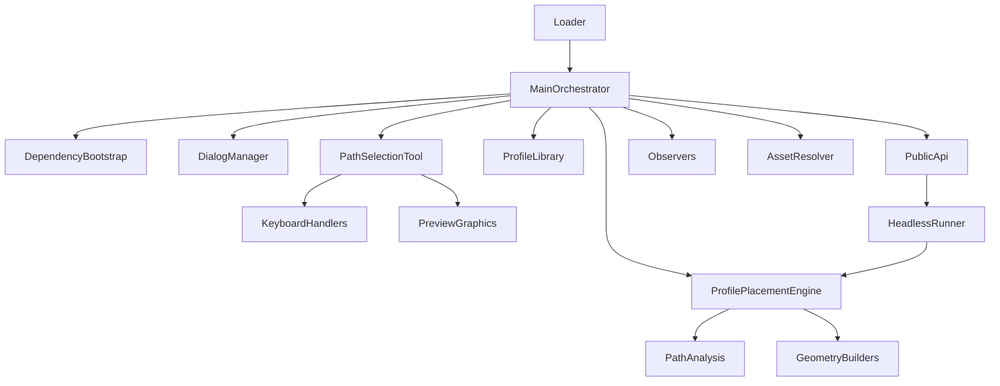
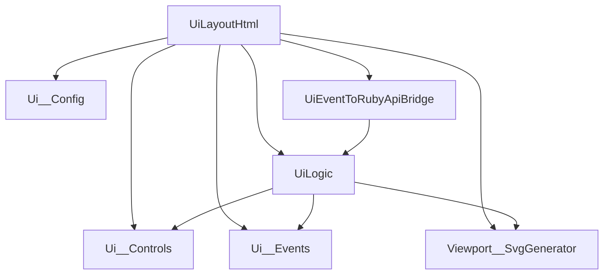

# Na__ProfileTools__ProfilePathTracer - Architecture

## File Map

### Root Loader
- `../Na__ProfileTools__ProfilePathTracer__Loader__.rb`

### Ruby Core Modules
- `Na__ProfileTools__ProfilePathTracer__Main__.rb`
- `Na__ProfileTools__ProfilePathTracer__PublicApi__.rb`
- `Na__ProfileTools__ProfilePathTracer__DependencyBootstrap__.rb`
- `Na__ProfileTools__ProfilePathTracer__AssetResolver__.rb`
- `Na__ProfileTools__ProfilePathTracer__DialogManager__.rb`
- `Na__ProfileTools__ProfilePathTracer__ProfileLibrary__.rb`
- `Na__ProfileTools__ProfilePathTracer__PathSelectionTool__.rb`
- `Na__ProfileTools__ProfilePathTracer__PathAnalysis__.rb`
- `Na__ProfileTools__ProfilePathTracer__ProfilePlacementEngine__.rb`
- `Na__ProfileTools__ProfilePathTracer__GeometryBuilders__.rb`
- `Na__ProfileTools__ProfilePathTracer__3dPreviewGraphics__.rb`
- `Na__ProfileTools__ProfilePathTracer__KeyboardHandlers__.rb`
- `Na__ProfileTools__ProfilePathTracer__HeadlessRunner__.rb`
- `Na__ProfileTools__ProfilePathTracer__Observers__.rb`
- `Na__ProfileTools__ProfilePathTracer__DebugTools__.rb`

### HtmlDialog Modules
- `Na__ProfileTools__ProfilePathTracer__UiLayout__.html`
- `Na__ProfileTools__ProfilePathTracer__Styles__.css`
- `Na__ProfileTools__ProfilePathTracer__UiLogic__.js`
- `Na__ProfileTools__ProfilePathTracer__UiEventToRubyApiBridge__.js`
- `Na__ProfileTools__ProfilePathTracer__Ui__Config__.js`
- `Na__ProfileTools__ProfilePathTracer__Ui__Controls__.js`
- `Na__ProfileTools__ProfilePathTracer__Ui__Events__.js`
- `Na__ProfileTools__ProfilePathTracer__Viewport__SvgGenerator__.js`

### Data/Docs
- `Na__ProfileTools__ProfilePathTracer__Config__.json`
- `Na__ProfileTools__ProfilePathTracer__ProfileLibrary__.json`
- `Na__ProfileTools__ProfilePathTracer__README__.md`
- `Na__ProfileTools__ProfilePathTracer__DEVLOG__.md`
- `Na__ProfileTools__ProfilePathTracer__Architecture__.md`

## Ruby Dependency Graph

## JavaScript Dependency Graph

## Runtime Flow

### Interactive UI Flow

1. Loader requires main orchestrator and registers menu/toolbar command.
2. Public API opens HtmlDialog via `DialogManager`.
3. JS bridge requests bootstrap payload from Ruby (profiles/options from JSON library).
4. UI renders profile selector and 2D SVG preview using `Viewport__SvgGenerator`.
5. Generate callback validates strict path selection and launches `PathSelectionTool`.
6. In SketchUp tool: red crosshair + TAB rotation + click vertex start.
7. Placement engine commits profile generation along ordered path (open chain or closed loop).

### Headless Flow

1. External caller invokes `Na__PublicApi__RunHeadless(config_hash)`.
2. `HeadlessRunner` passes payload into `ProfilePlacementEngine`.
3. Path analysis enforces strict non-branching path rules.
4. Geometry builders transform profile and build result group via follow-path generation.

## External Dependencies

- `../Na__Common__DataLib__CoreSuEntityStandards`
  - `Na__DataLib__CacheData.Na__Cache__LoadData(:tags)`
  - `Na__DataLib__CacheData.Na__Cache__LoadData(:materials)`
- `../Na__Common__PluginDependencies`
  - shared icon/logo asset paths resolved via `AssetResolver`
