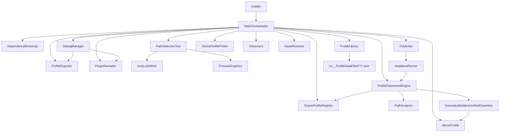
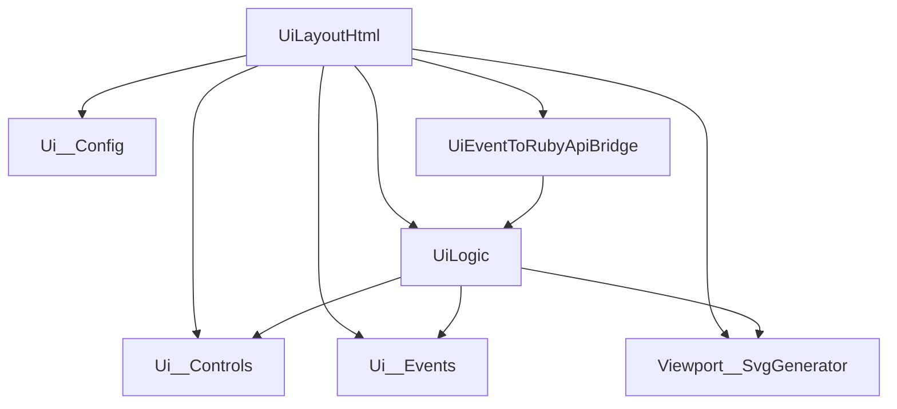

# Na__ProfileTools__ProfilePathTracer - Architecture

## File Map

### Root Loader
- `../Na__ProfileTools__ProfilePathTracer__Loader__.rb`

### Ruby Core Modules
- `Na__ProfileTools__ProfilePathTracer__Main__.rb`
- `Na__ProfileTools__ProfilePathTracer__PublicApi__.rb`
- `Na__ProfileTools__ProfilePathTracer__DependencyBootstrap__.rb`
- `Na__ProfileTools__ProfilePathTracer__AssetResolver__.rb`
- `Na__ProfileTools__ProfilePathTracer__DialogManager__.rb`
- `Na__ProfileTools__ProfilePathTracer__ProfileLibrary__.rb`
- `Na__ProfileTools__ProfilePathTracer__ProfileExporter__.rb`
- `Na__ProfileTools__ProfilePathTracer__MirrorProfile__.rb`
- `Na__ProfileTools__ProfilePathTracer__PluginReloader__.rb`
- `Na__ProfileTools__ProfilePathTracer__PathSelectionTool__.rb`
- `Na__ProfileTools__ProfilePathTracer__AxisLockMixin__.rb`
- `Na__ProfileTools__ProfilePathTracer__SceneProfileRegistry__.rb`
- `Na__ProfileTools__ProfilePathTracer__SceneProfilePicker__.rb`
- `Na__ProfileTools__ProfilePathTracer__PathAnalysis__.rb`
- `Na__ProfileTools__ProfilePathTracer__ProfilePlacementEngine__.rb`
- `Na__ProfileTools__ProfilePathTracer__GeometryBuilders__UnifiedOverrides__.rb`
- `Na__ProfileTools__ProfilePathTracer__3dPreviewGraphics__.rb`
- `Na__ProfileTools__ProfilePathTracer__KeyboardHandlers__.rb`
- `Na__ProfileTools__ProfilePathTracer__HeadlessRunner__.rb`
- `Na__ProfileTools__ProfilePathTracer__Observers__.rb`
- `Na__ProfileTools__ProfilePathTracer__DebugTools__.rb`

### HtmlDialog Modules
- `Na__ProfileTools__ProfilePathTracer__UiLayout__.html`
- `Na__ProfileTools__ProfilePathTracer__Styles__.css`
- `Na__ProfileTools__ProfilePathTracer__UiLogic__.js`
- `Na__ProfileTools__ProfilePathTracer__UiEventToRubyApiBridge__.js`
- `Na__ProfileTools__ProfilePathTracer__Ui__Config__.js`
- `Na__ProfileTools__ProfilePathTracer__Ui__Controls__.js`
- `Na__ProfileTools__ProfilePathTracer__Ui__Events__.js`
- `Na__ProfileTools__ProfilePathTracer__Viewport__SvgGenerator__.js`

### Data/Docs
- `Na__ProfileTools__ProfilePathTracer__Config__.json`
- `Na__ProfileTools__ProfilePathTracer__ProfileLibrary__.json`
- `01__ProfileDataFiles/` (user-created unified JSON profile files, scanned recursively)
- `Na__ProfileTools__ProfilePathTracer__README__.md`
- `Na__ProfileTools__ProfilePathTracer__DEVLOG__.md`
- `Na__ProfileTools__ProfilePathTracer__Architecture__.md`

## Ruby Dependency Graph

```mermaid
flowchart TD
loader[Loader] --> main[MainOrchestrator]
main --> dep[DependencyBootstrap]
main --> dialog[DialogManager]
main --> api[PublicApi]
main --> lib[ProfileLibrary]
main --> exporter[ProfileExporter]
main --> mirror[MirrorProfile]
main --> reloader[PluginReloader]
main --> pathTool[PathSelectionTool]
pathTool --> axisLock[AxisLockMixin]
pathTool --> preview[PreviewGraphics]
main --> sceneRegistry[SceneProfileRegistry]
main --> scenePicker[SceneProfilePicker]
main --> engine[ProfilePlacementEngine]
engine --> pathAnalysis[PathAnalysis]
engine --> geometryUnified[GeometryBuildersUnifiedOverrides]
engine --> sceneRegistry
geometryUnified --> mirror
api --> headless[HeadlessRunner]
headless --> engine
main --> observers[Observers]
main --> assets[AssetResolver]
lib --> dataFiles["01__ProfileDataFiles/**/*.json"]
dialog --> exporter
dialog --> reloader
```

## JavaScript Dependency Graph

```mermaid
flowchart TD
layout[UiLayoutHtml] --> config[Ui__Config]
layout --> controls[Ui__Controls]
layout --> events[Ui__Events]
layout --> svgGen[Viewport__SvgGenerator]
layout --> uiLogic[UiLogic]
layout --> bridge[UiEventToRubyApiBridge]
uiLogic --> controls
uiLogic --> events
uiLogic --> svgGen
bridge --> uiLogic
```

## Reuse Mapping (Array Builder -> Profile Path Tracer)

- `Na__ArrayBuilder__PathTool__.rb` -> `Na__ProfileTools__ProfilePathTracer__PathSelectionTool__.rb`
  - Waypoint capture lifecycle, finish gestures, undo, per-frame preview cache pattern.
- `Na__ArrayBuilder__AxisLockMixin__.rb` -> `Na__ProfileTools__ProfilePathTracer__AxisLockMixin__.rb`
  - Arrow-key lock model (`view.lock_inference`) with lock re-anchor semantics.
- `Na__ArrayBuilder__ObjectPicker__.rb` -> `Na__ProfileTools__ProfilePathTracer__SceneProfilePicker__.rb`
  - Top-level Group/Component picking and hover wireframe.
- `Na__ArrayBuilder__ObjectRegistry__.rb` -> `Na__ProfileTools__ProfilePathTracer__SceneProfileRegistry__.rb`
  - Stateful picked-source cache and status payload contract.
- `Na__ArrayBuilder__ModelObservers__.rb` -> `Na__ProfileTools__ProfilePathTracer__Observers__.rb`
  - App/definitions observer lifecycle to invalidate stale scene-source references.

## Runtime Flow

### Interactive UI Flow

1. Loader requires main orchestrator and registers menu/toolbar command.
2. Public API opens HtmlDialog via `DialogManager`.
3. JS bridge requests bootstrap payload from Ruby (profiles/options from JSON library).
4. UI renders profile source controls (Library or Scene Pick), profile selector, and 2D SVG preview using `Viewport__SvgGenerator`.
5. Toggle metadata/defaults load from `Config__.json` and are included in bootstrap payload.
6. Controls panel is user-focused: `Generate` and `Create New Profile`; `Reload Plugin` lives in the header as a developer action (headless remains API-only).
7. Optional scene-source callback launches `SceneProfilePicker`; strict validation requires one top-level planar face in the picked Group/Component.
8. Generate callback resolves profile source (library or scene), then:
   - `selection` mode: builds immediately from selected edge path;
   - `interactive` mode: launches `PathSelectionTool`.
9. In SketchUp interactive mode: click-waypoint drawing, arrow-key axis locks, TAB rotation, Enter/right-click/double-click finish, Backspace undo.
10. Placement engine applies mirror toggles via `MirrorProfile` before final transform and commits profile generation along ordered path.

### Developer Hot Reload Flow

1. User clicks "Reload Plugin" in the dialog.
2. JS bridge calls `na_profilepathtracer_reload_plugin`.
3. Ruby `DialogManager` delegates to `Na__PluginReloader.Na__Reload__PluginFiles`.
4. All Ruby files in the module folder are `load`ed and expected JS assets are validated.
5. Callback captures the previous dialog reference before reload, then closes/reopens deterministically so module ivar resets do not strand status updates.
6. Reloader forces unified geometry runtime files to load last, then runtime source is revalidated before dialog handoff.
7. Final reload status is posted into the reopened dialog (success/warning text with first issue details when applicable).

### Geometry Runtime Guard + Edge Classification

1. `Main__.rb` exposes `Na__Runtime__EnsureUnifiedGeometryBuilders` to assert active method source for `Na__Geometry__BuildProfileAlongPath`.
2. `ProfilePlacementEngine` calls runtime assertion before generation and self-heals stale implementations by reloading unified overrides.
3. Unified edge-state pass (`GeometryBuilders__UnifiedOverrides__.rb`) classifies edge roles:
   - excludes original path edges,
   - excludes open-path end-cap plane edges,
   - applies soft/smooth only to topology-confirmed connector/run edges (`edge.faces.length >= 2`) so end-cap perimeter edges remain hard.
4. Both selection-mode and interactive-mode generation terminate at the same `GenerateFromPathData` call path and therefore share identical style inference logic.

### Regression Matrix (Determinism Validation)

- First launch, selection mode, open path: verify connector/run edges infer soft/smooth while end caps remain hard.
- First launch, interactive mode, open path (finish via Enter + double-click): verify same styling outcome as selection mode.
- Post-reload, selection mode, open + closed paths: verify style counts and cap hardness match first-launch behaviour.
- Post-reload, interactive mode, open + closed paths: verify style parity with first-launch and no mode-specific drift.

### Create New Profile Flow

1. User clicks "Create New Profile" button in the dialog.
2. JS bridge calls `na_profilepathtracer_validate_for_export` -> Ruby `Na__ProfileExporter.Na__Exporter__ValidateSelection`.
3. If valid, JS shows the meta form panel with fields: Profile Name, Description, Keywords, Profile ID, auto-filled Timestamp and Units.
4. User fills in fields and clicks "Save Profile Data File".
5. JS bridge calls `na_profilepathtracer_save_profile` with meta fields JSON.
6. Ruby starts origin-point picking before save commit.
7. User clicks viewport location for local UCS.
8. Exporter writes unified schema JSON (`meta`, `Na__Asset__Metadata`, `Na__Asset__Profile2D`, `Na__Asset__Mesh3D`) to `01__ProfileDataFiles/`.
9. Exporter creates persistent `00__OriginPoint` helper at clicked point, sets tag `02__DoorHelpers__RotationPivots`, colours helper edges `MTE201__LineColour__Red`.
10. `DialogManager` reloads bootstrap payload and UI refreshes profile dropdown.

### Profile Data Format (Unified Schema)

Individual profile files in `01__ProfileDataFiles/` now use the unified contract:
- `meta`
- `Na__Asset__Metadata`
- `Na__Asset__Profile2D`
  - `Na__Geometry__Vertices` (`VertexId`, `PosY_mm`, `PosZ_mm`)
  - `Na__Geometry__Edges` (`EdgeId`, `StartVertex`, `EndVertex`)
  - `Na__Geometry__Faces` (`FaceId`, `OuterLoopVertices`)
- `Na__Asset__Mesh3D`
  - `Na__Geometry__Edges` style fields:
    - `IsSoft`, `IsSmooth`, `IsHidden`, `CastsShadows`
    - `EdgeMaterialName`, `EdgeColourId`, `EdgeColourHex`

`ProfileLibrary` accepts this schema only. Legacy `polyline2d` and legacy `meta/vertices/edges/faces` root files are rejected.

### Headless Flow

1. External caller invokes `Na__PublicApi__RunHeadless(config_hash)`.
2. `HeadlessRunner` passes payload into `ProfilePlacementEngine`.
3. Path analysis enforces strict non-branching path rules.
4. Geometry builders apply mirror toggles (`flipXCenter`, `flipYCenter`, `flipXWorld`, `flipYWorld`) and build result group via follow-path generation.

### Roundtrip Validation Flow

1. External caller invokes `Na__PublicApi__RunRoundtripValidation(profile_key, selected_entities = nil)`.
2. API reads source edge stats from `Na__Asset__Mesh3D.Na__Geometry__Edges`.
3. If path entities are provided, generation runs and produced group edge stats are collected.
4. API returns source/generated stats plus deltas for soft/smooth/hidden/colour counts.

## External Dependencies

- `../Na__Common__DataLib__CoreSuEntityStandards`
  - `Na__DataLib__CacheData.Na__Cache__LoadData(:tags)`
  - `Na__DataLib__CacheData.Na__Cache__LoadData(:materials)`
  - `Na__DataLib__CacheData.Na__Cache__LoadData(:edge_materials)`
- `../Na__Common__PluginDependencies`
  - shared icon/logo asset paths resolved via `AssetResolver`
