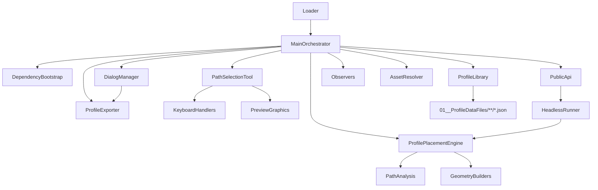
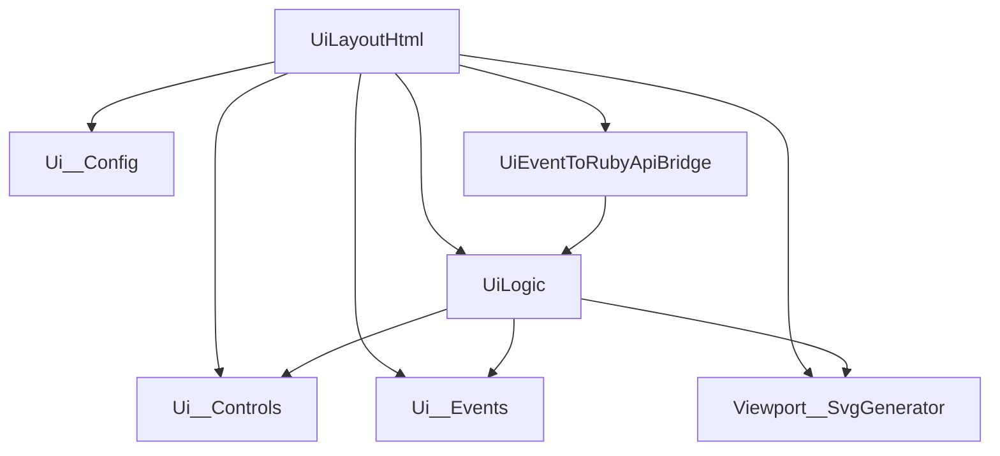

# Na__ProfileTools__ProfilePathTracer - Architecture

## File Map

### Root Loader
- `../Na__ProfileTools__ProfilePathTracer__Loader__.rb`

### Ruby Core Modules
- `Na__ProfileTools__ProfilePathTracer__Main__.rb`
- `Na__ProfileTools__ProfilePathTracer__PublicApi__.rb`
- `Na__ProfileTools__ProfilePathTracer__DependencyBootstrap__.rb`
- `Na__ProfileTools__ProfilePathTracer__AssetResolver__.rb`
- `Na__ProfileTools__ProfilePathTracer__DialogManager__.rb`
- `Na__ProfileTools__ProfilePathTracer__ProfileLibrary__.rb`
- `Na__ProfileTools__ProfilePathTracer__ProfileExporter__.rb`
- `Na__ProfileTools__ProfilePathTracer__PathSelectionTool__.rb`
- `Na__ProfileTools__ProfilePathTracer__PathAnalysis__.rb`
- `Na__ProfileTools__ProfilePathTracer__ProfilePlacementEngine__.rb`
- `Na__ProfileTools__ProfilePathTracer__GeometryBuilders__.rb`
- `Na__ProfileTools__ProfilePathTracer__3dPreviewGraphics__.rb`
- `Na__ProfileTools__ProfilePathTracer__KeyboardHandlers__.rb`
- `Na__ProfileTools__ProfilePathTracer__HeadlessRunner__.rb`
- `Na__ProfileTools__ProfilePathTracer__Observers__.rb`
- `Na__ProfileTools__ProfilePathTracer__DebugTools__.rb`

### HtmlDialog Modules
- `Na__ProfileTools__ProfilePathTracer__UiLayout__.html`
- `Na__ProfileTools__ProfilePathTracer__Styles__.css`
- `Na__ProfileTools__ProfilePathTracer__UiLogic__.js`
- `Na__ProfileTools__ProfilePathTracer__UiEventToRubyApiBridge__.js`
- `Na__ProfileTools__ProfilePathTracer__Ui__Config__.js`
- `Na__ProfileTools__ProfilePathTracer__Ui__Controls__.js`
- `Na__ProfileTools__ProfilePathTracer__Ui__Events__.js`
- `Na__ProfileTools__ProfilePathTracer__Viewport__SvgGenerator__.js`

### Data/Docs
- `Na__ProfileTools__ProfilePathTracer__Config__.json`
- `Na__ProfileTools__ProfilePathTracer__ProfileLibrary__.json`
- `01__ProfileDataFiles/` (user-created rich JSON profile files, scanned recursively)
- `Na__ProfileTools__ProfilePathTracer__README__.md`
- `Na__ProfileTools__ProfilePathTracer__DEVLOG__.md`
- `Na__ProfileTools__ProfilePathTracer__Architecture__.md`

## Ruby Dependency Graph

```mermaid
flowchart TD
loader[Loader] --> main[MainOrchestrator]
main --> dep[DependencyBootstrap]
main --> dialog[DialogManager]
main --> api[PublicApi]
main --> lib[ProfileLibrary]
main --> exporter[ProfileExporter]
main --> pathTool[PathSelectionTool]
pathTool --> keyboard[KeyboardHandlers]
pathTool --> preview[PreviewGraphics]
main --> engine[ProfilePlacementEngine]
engine --> pathAnalysis[PathAnalysis]
engine --> geometry[GeometryBuilders]
api --> headless[HeadlessRunner]
headless --> engine
main --> observers[Observers]
main --> assets[AssetResolver]
lib --> dataFiles["01__ProfileDataFiles/**/*.json"]
dialog --> exporter
```

## JavaScript Dependency Graph

```mermaid
flowchart TD
layout[UiLayoutHtml] --> config[Ui__Config]
layout --> controls[Ui__Controls]
layout --> events[Ui__Events]
layout --> svgGen[Viewport__SvgGenerator]
layout --> uiLogic[UiLogic]
layout --> bridge[UiEventToRubyApiBridge]
uiLogic --> controls
uiLogic --> events
uiLogic --> svgGen
bridge --> uiLogic
```

## Runtime Flow

### Interactive UI Flow

1. Loader requires main orchestrator and registers menu/toolbar command.
2. Public API opens HtmlDialog via `DialogManager`.
3. JS bridge requests bootstrap payload from Ruby (profiles/options from JSON library).
4. UI renders profile selector and 2D SVG preview using `Viewport__SvgGenerator`.
5. Generate callback validates strict path selection and launches `PathSelectionTool`.
6. In SketchUp tool: red crosshair + TAB rotation + click vertex start.
7. Placement engine commits profile generation along ordered path (open chain or closed loop).

### Create New Profile Flow

1. User clicks "Create New Profile" button in the dialog.
2. JS bridge calls `na_profilepathtracer_validate_for_export` -> Ruby `Na__ProfileExporter.Na__Exporter__ValidateSelection`.
3. If valid, JS shows the meta form panel with fields: Profile Name, Description, Keywords, Profile ID, auto-filled Timestamp and Units.
4. User fills in fields and clicks "Save Profile Data File".
5. JS bridge calls `na_profilepathtracer_save_profile` with meta fields JSON.
6. Ruby `Na__ProfileExporter.Na__Exporter__RunExport` collects geometry from selection, builds rich JSON payload, opens OS save dialog (default: `01__ProfileDataFiles/`), writes file.
7. On success, `DialogManager` reloads bootstrap payload (re-scans `01__ProfileDataFiles`) and sends updated profile list to JS.
8. UI hides the form panel and refreshes the profile dropdown.

### Profile Data Format (rich_geometry)

Individual profile files in `01__ProfileDataFiles/` use the rich geometry JSON format:
- `meta`: ProfileName, Description, Timestamp, GlobalUnits, Keywords, ProfileId
- `vertices`: count + items array (VertexId, PosX, PosY, PosZ, W in millimetres)
- `edges`: count + items array (v1, v2, direction, length_mm, soft, smooth, hidden)
- `faces`: count + items array (outer loop indices, inner loops, normal, area_mm2)

`ProfileLibrary` scans this directory recursively and converts each file to the internal profile format with `profileData.type = "rich_geometry"`. `GeometryBuilders` branches on this type to build faces directly from vertex/face data.

### Headless Flow

1. External caller invokes `Na__PublicApi__RunHeadless(config_hash)`.
2. `HeadlessRunner` passes payload into `ProfilePlacementEngine`.
3. Path analysis enforces strict non-branching path rules.
4. Geometry builders transform profile and build result group via follow-path generation.

## External Dependencies

- `../Na__Common__DataLib__CoreSuEntityStandards`
  - `Na__DataLib__CacheData.Na__Cache__LoadData(:tags)`
  - `Na__DataLib__CacheData.Na__Cache__LoadData(:materials)`
- `../Na__Common__PluginDependencies`
  - shared icon/logo asset paths resolved via `AssetResolver`
